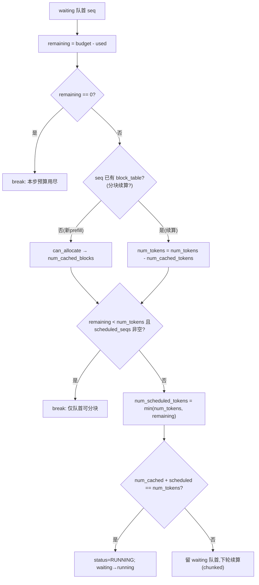
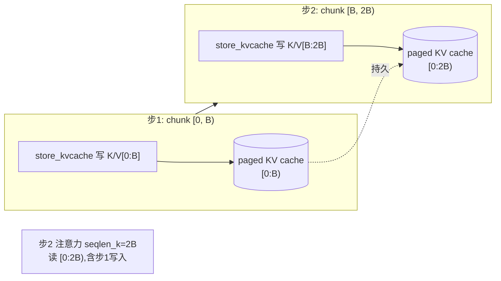
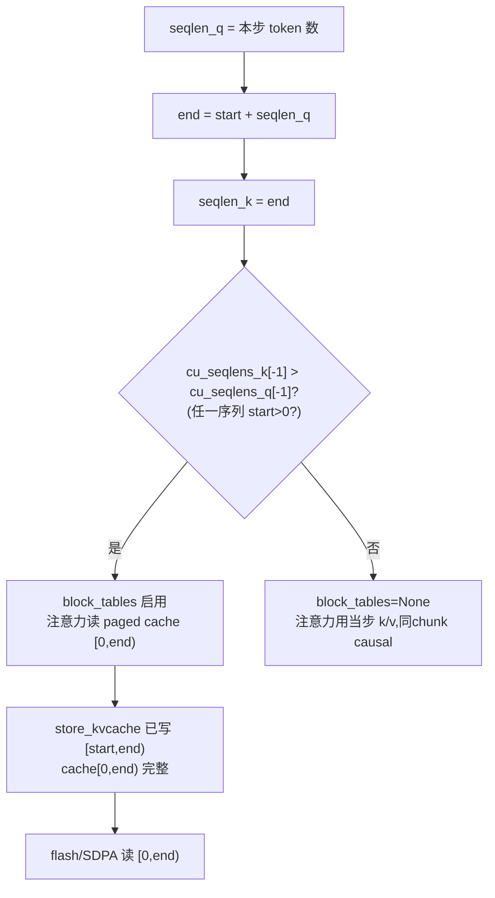
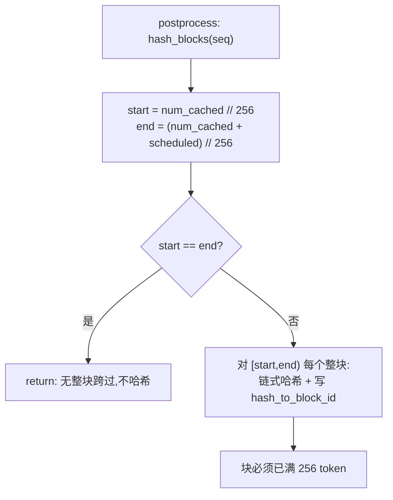
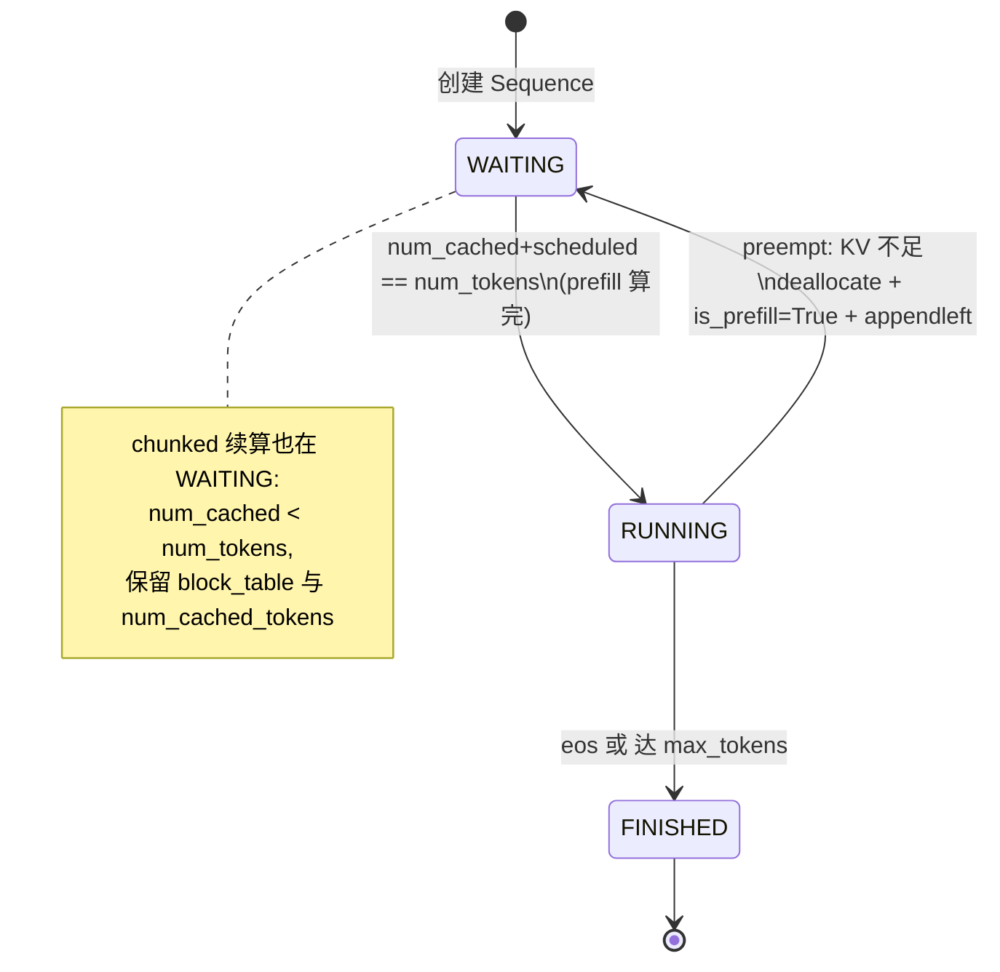
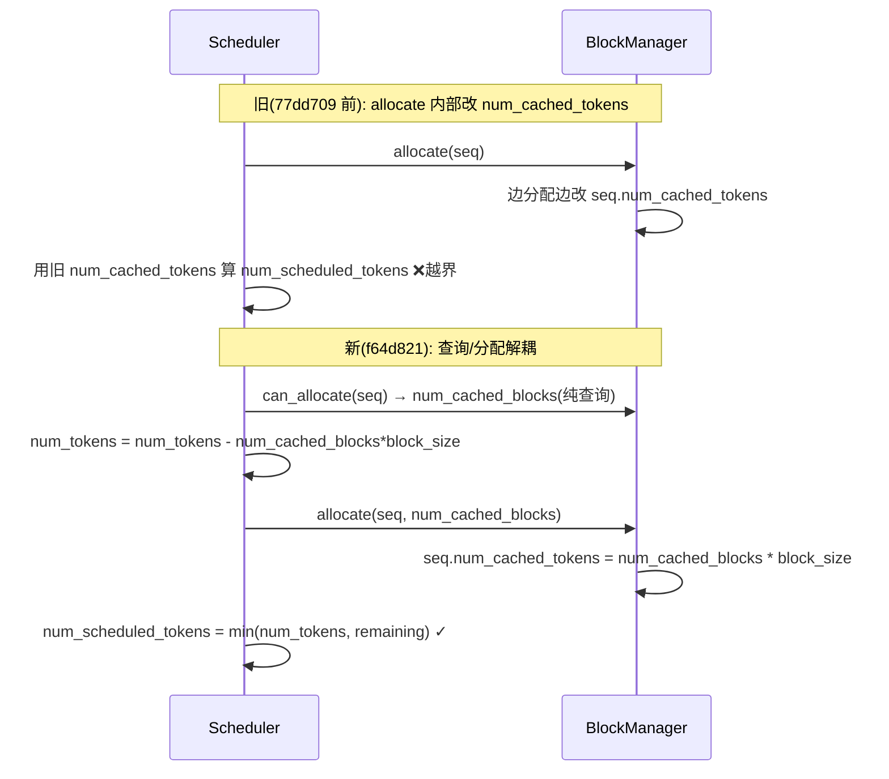

## nano-vllm-npu 模块细化分析:Chunked Prefill 边界

延续 [CODEXTMS-23](mention://issue/01a048c1-5f03-715e-ab5c-5193cb298059) 的分模块分析,本篇聚焦**单一模块——chunked prefill 的"边界"**进行细化拆解。代码位于 `nanovllm/engine/`,分支 `main`,提交 `ed4b9cc`。

"边界"在这里不是一个单一概念,而是 chunked prefill 正确性所依赖的**六类边界条件**。每一类边界都对应一段不变式(invariant),破坏不变式即触发 bug。事实上,该模块的演进史(5 个提交)几乎全是边界 bug 的修复——本文逐类拆解这些边界、其不变式、破坏点与修复。

---

## 〇、什么是 chunked prefill,边界为何关键

当 prompt 长度超过单步可处理的 token 预算(`max_num_batched_tokens`,默认 16384)时,prompt 被切成多个 chunk,分多步完成 prefill。这带来一个核心难题:**每一步只能看到部分 token,但注意力需要"看到"此前所有已处理 token**。于是引入了 paged KV cache 作为跨步记忆,以及一系列用于对齐 chunk / 块 / 缓存的边界算术。

边界之所以关键,是因为 chunked prefill 在**多个坐标系**之间做切片:
- **token 坐标系**:prompt 的 token 序号 `[0, num_tokens)`
- **chunk 坐标系**:本轮调度 `[start, end)`,`start = num_cached_tokens`,`end = start + num_scheduled_tokens`
- **block 坐标系**:KV cache 以 `block_size=256` 分页,block 序号 `i` 持有 `token_ids[i*256:(i+1)*256]`
- **slot 坐标系**:扁平物理槽位 `slot = block_id * block_size + offset`

四套坐标系几乎从不对齐,所有"边界 bug"都源于某一处把"本应跨坐标系换算"的算术算错了。下文六类边界即围绕这些换算展开。

### 关键参数速查

| 参数 | 默认值 | 位置 | 作用 |
|---|---|---|---|
| `max_num_batched_tokens` | 16384 | `config.py:9` | 单步 token 预算上限 |
| `kvcache_block_size` | 256 | `config.py:19` | KV cache 分页大小 |
| `max_num_seqs` | 512 | `config.py:10` | 单 batch 最大序列数 |
| `num_kvcache_blocks` | 自测 | `model_runner.py:136` | KV cache 物理块数 |

---

## 一、预算边界(budget boundary)

### 1.1 边界定义

每步 prefill 的 token 总数不得超过 `max_num_batched_tokens`。调度器用 `remaining` 跟踪本步剩余预算:

```python
# scheduler.py:32
remaining = self.max_num_batched_tokens - num_batched_tokens
if remaining == 0:
    break
```

### 1.2 "仅队首可分块"不变式

```python
# scheduler.py:42
if remaining < num_tokens and scheduled_seqs:  # only allow chunked prefill for the first seq
    break
```

**不变式**:一个 prefill batch 中,**至多一个序列被分块,且必须是 waiting 队首**。一旦 `scheduled_seqs` 非空(已有序列入 batch),任何"放不下"的后续序列直接 `break`,而非被分块。

**推论**:batch 的组成只能是"队首(可能分块)+ 若干整批放得下的短序列",绝不允许两个分块序列共存于同一 batch。这是性能与实现简洁性的取舍——避免多序列同时跨步带来的复杂 KV 对齐。

### 1.3 边界行为细节

队首序列若 `remaining < num_tokens` 且 `scheduled_seqs` 为空 → **不分块而是被切**:`num_scheduled_tokens = min(num_tokens, remaining)`(`scheduler.py:46`)。此时 `num_cached_tokens + num_scheduled_tokens < num_tokens`,序列**留在 waiting 队首**(`scheduler.py:48` 判定为未算完),下一轮 `schedule` 仍是它,继续啃剩余部分,直至预算耗尽或算完。



---

## 二、分块边界(chunk boundary)

### 2.1 边界定义

每步对某序列实际处理的 token 区间为 `[start, end)`,其中:

```python
# model_runner.py:162-165
start = seq.num_cached_tokens        # 已"落账"的 token 数(此前步累计)
seqlen_q = seq.num_scheduled_tokens  # 本步要算的 token 数
end = start + seqlen_q
seqlen_k = end                        # 注意力的 K/V 长度 = end(关键!)
```

`start` / `end` 是 chunk 在 token 坐标系下的边界。`seqlen_k = end` 是**整个 chunked prefill 最核心的不变式**(见 §3.3)。

### 2.2 `num_cached_tokens` 的语义边界

注意 `num_cached_tokens` 在本项目里**语义偏移**:它不是"prefix cache 命中的 token 数",而是**"已经过 prefill 并写入 KV cache 的 token 数"**(无论是否来自 prefix cache 命中)。它在 `postprocess` 中递增:

```python
# scheduler.py:84
seq.num_cached_tokens += seq.num_scheduled_tokens
```

因此对于分块序列,`num_cached_tokens` 标记的是**chunk 的推进进度**——即下一步的 `start`。这个语义在 `f64d821` 重构后被统一(此前 `allocate` 里直接改 `num_cached_tokens`,与 postprocess 双写,易错)。

### 2.3 分块对 KV cache 的写入

`prepare_prefill` 为 `[start, end)` 计算每个 token 落入的物理 slot(见 §3),`store_kvcache`(`attention.py:8`)把本步算出的 K/V 写入 paged cache。于是跨步记忆成立:第 N 步的注意力可以读到第 0..N-1 步写入的 K/V。



---

## 三、块/页边界(block / page boundary)

### 3.1 边界定义

KV cache 按 `block_size=256` 分页。一个 chunk `[start, end)` 几乎从不在块边界上起止,因此 `prepare_prefill` 必须把 `[start, end)` 映射到**首尾可能各残缺一块**的 slot 序列:

```python
# model_runner.py:174-184
start_block = start // self.block_size
end_block = (end + self.block_size - 1) // self.block_size    # 向上取整
for i in range(start_block, end_block):
    slot_start = seq.block_table[i] * self.block_size
    if i == start_block:
        slot_start += start % self.block_size    # 首块:从 chunk 起点偏移
    if i != end_block - 1:
        slot_end = seq.block_table[i] * self.block_size + self.block_size    # 中间块:整块
    else:
        slot_end = seq.block_table[i] * self.block_size + end - i * self.block_size    # 末块:到 chunk 终点
    slot_mapping.extend(range(slot_start, slot_end))
```

**不变式**:`slot_mapping` 的长度恰为 `seqlen_q`(即 `end - start`),且与 `input_ids` 逐 token 对齐。`store_kvcache` 据此把 K/V 写到正确的物理槽。

### 3.2 "末块永不被缓存命中"不变式(关键设计)

`can_allocate` 遍历块时**刻意排除最后一块**:

```python
# block_manager.py:62
for i in range(seq.num_blocks - 1):    # 注意是 num_blocks - 1,不含末块
```

这带来两个连锁不变式:

1. **`num_cached_blocks <= num_blocks - 1`**:无论 prefix cache 多充分,末块永远不命中。
2. **fresh 序列的待 prefill token 数恒 ≥ 1**:
   ```python
   # scheduler.py:39
   num_tokens = seq.num_tokens - num_cached_blocks * self.block_size
   ```
   因为 `num_cached_blocks <= num_blocks-1`,而 `num_blocks = ceil(num_tokens / block_size)`,所以 `num_tokens - (num_blocks-1)*block_size` 至少为末块的 token 数(≥1)。

这一条直接支撑了重构 `f64d821` 中**移除旧的 `max(..., 1)` 兜底**的安全性——见 §6.2。它也避免了"prompt 恰为 block_size 整数倍且全量命中 → 待算 0 token → 空 prefill"的死循环/错位陷阱。

### 3.3 decode 阶段的块边界

decode 每步只加 1 token,是否申请新块由取模规则决定:

```python
# block_manager.py:103-108
def can_append(self, seq):
    return len(self.free_block_ids) >= (len(seq) % self.block_size == 1)
def may_append(self, seq):
    if len(seq) % self.block_size == 1:
        seq.block_table.append(self._allocate_block())
```

**不变式**:仅当 `len(seq) % block_size == 1` 时需要新块(此时新 token 落入一个全新空块的 offset 0);否则落入已分配的末块下一槽位。`can_append` 用布尔转整数(`True→1, False→0`)表达"需要 0 或 1 个空闲块"。

slot 定位(注意 `last_block_num_tokens` 是末块已占 token 数):

```python
# model_runner.py:204
slot_mapping.append(seq.block_table[-1] * self.block_size + seq.last_block_num_tokens - 1)
```

**边界推演**(block_size=256):
- prefill 结束时 `num_tokens=256`(整块)→ append 后 `257`,`257%256==1` → 申请新块,token256 落新块 offset 0。✓
- prefill 结束时 `num_tokens=257`(末块1 token)→ append 后 `258`,`258%256==2` → 不申请新块,token257 落末块 offset 1。✓

---

## 四、前缀缓存边界(prefix-cache boundary)

### 4.1 边界定义

prefix cache 让多个序列共享相同 prompt 前缀的 KV 块(引用计数 `ref_count`)。命中边界由 `can_allocate` 的链式哈希确定:只有**完整前缀链**匹配才算命中(`block_manager.py:62-73`)。

`num_cached_blocks` 个块被共享,`allocate`(`block_manager.py:75-92`)对命中块 `ref_count += 1`,对未命中块 `_allocate_block`。于是:

```python
# scheduler.py:39 (新prefill)
num_tokens = seq.num_tokens - num_cached_blocks * self.block_size
# scheduler.py:41 (分块续算)
num_tokens = seq.num_tokens - seq.num_cached_tokens
```

### 4.2 `seqlen_k = end` 不变式(最核心)

这是 chunked prefill + prefix cache 的**生死线**:

```python
# model_runner.py:165
seqlen_k = end    # = start + seqlen_q
```

**不变式**:注意力只能覆盖 `[0, end)`——即**已写入 cache 的全部 token**(prefix cache 命中的 + 本步刚 store 的)。绝不能是 `len(seq)`(全序列长),因为尚未调度的未来 token 在 cache 中是**未初始化的脏数据**。

**破坏点(历史 bug `25794a1`,#212)**:旧代码 `seqlen_k = len(seq)`,导致注意力 kernel 访问本步尚未填入的 KV 槽——读到的是上一个使用该物理块序列留下的残值,表现为输出错乱/数值异常。修复即把 `seqlen_k` 置为 `end`。

### 4.3 `block_tables` 的门控边界

```python
# model_runner.py:185-186
if cu_seqlens_k[-1] > cu_seqlens_q[-1]:    # prefix cache
    block_tables = self.prepare_block_tables(seqs)
```

**不变式**:只要任一序列的 `seqlen_k > seqlen_q`(即 `start > 0`,存在缓存前缀或处于分块续算),就启用 `block_tables`,注意力从 paged cache 读 K/V;否则 `block_tables=None`,注意力直接用模型当步算出的 k/v(同 chunk 内 causal)。

这覆盖两种 `start > 0` 的来源:
- **prefix cache 命中**:`num_cached_blocks > 0` → `start = num_cached_blocks * 256`。
- **分块续算**:上一 chunk 把 `num_cached_tokens` 推到 `start`。

注意 **flash 路径**(`attention.py:115-125`)在 `block_tables is not None` 时直接 `k, v = k_cache, v_cache`——丢弃模型当步算出的 k/v,改读 cache。这是安全的,因为 `store_kvcache` 已先把本步 K/V 写入 cache,cache 的 `[0, end)` 是完整的。**SDPA 回退路径**(`attention.py:134`)则 `_gather_kv_from_cache` 按 `seq_lens_k` 聚合 `[0, end)`。



---

## 五、哈希链边界(hash-chain boundary)

### 5.1 边界定义

prefix cache 的命中基于**链式哈希**:第 `i` 块的哈希 = `hash(第i块token_ids, prefix=第i-1块哈希)`(`block_manager.py:35-41`)。只有完整前缀链匹配才算命中。

### 5.2 hash_blocks 的"整块"不变式

```python
# block_manager.py:110-120
def hash_blocks(self, seq):
    start = seq.num_cached_tokens // self.block_size
    end = (seq.num_cached_tokens + seq.num_scheduled_tokens) // self.block_size
    if start == end: return    # 本步未跨过任何整块边界 → 不哈希
    h = self.blocks[seq.block_table[start - 1]].hash if start > 0 else -1
    for i in range(start, end):
        ...                    # 仅对 [start, end) 内的完整块哈希
```

**不变式**:**只有被完全填满的整块**才被哈希并写入 `hash_to_block_id`。整除运算 `// block_size` 保证了部分块(末块未满)永不被哈希。

**推论**:`start == end` 时(本步未跨过整块边界)直接返回——这是 prefill 中间 chunk 与 decode 绝大多数步的常态。

### 5.3 残留哈希条目的安全性

被哈希的块在序列结束后 `deallocate` 释放(`ref_count→0`),但其 `hash_to_block_id` 条目**不会被主动删除**,只在该物理块被 `_allocate_block` 重用时按需清除(`block_manager.py:47-48`)。

**安全性保证**:即使残留条目指向已释放块,`can_allocate` 同时校验 `self.blocks[block_id].token_ids != token_ids`(`block_manager.py:66`)。释放块 `reset()` 后 `token_ids=[]`,与新序列的非空块必然不等,故不会误命中。代价是哈希表存在少量"悬空"条目(空间浪费,非正确性问题)。

### 5.4 跨 prompt/completion 边界的块

一个微妙边界:末块若在 **decode 阶段**才填满(因 prefill 结束时末块是部分的),它会被 `hash_blocks` 哈希,而该块的 `token_ids` 可能**横跨 prompt 与 completion token**。但由于 §3.2 的"末块永不被 `can_allocate` 查询"规则,**末块本身不会被用作新序列的命中源**;只有当它变成更长相列的非末块时才参与查询,而彼时其内容已与目标序列的对应块逐 token 比对——不会误命中。



---

## 六、状态边界(state boundary)

### 6.1 prefill ↔ decode 转换边界

```python
# scheduler.py:48
if seq.num_cached_tokens + seq.num_scheduled_tokens == seq.num_tokens:
    seq.status = SequenceStatus.RUNNING
    self.waiting.popleft()
    self.running.append(seq)
```

**不变式**:当且仅当 `num_cached_tokens + num_scheduled_tokens == num_tokens`(本轮把剩余 token 全部算完)时,序列从 `WAITING` 转为 `RUNNING`,下一步进入 decode。

`postprocess` 中的镜像边界(`scheduler.py:86-87`):prefill 且 `num_cached_tokens < num_tokens` → `continue`(不追加 token,等待下一 chunk);否则 `append_token`(补上采样出的首个 completion token)。

### 6.2 `is_prefill` 标志与 IPC 边界

```python
# sequence.py:72-73
def __getstate__(self):
    last_state = self.last_token if not self.is_prefill else self.token_ids
```

**不变式**:`is_prefill=True` 时跨进程 pickle 传**完整 token_ids**(prefill 需要全部输入);`is_prefill=False` 时只传 `last_token`(decode 仅需上一 token),压低 IPC 负载。

`preempt`(`scheduler.py:75-79`)必须把 `is_prefill` 重置为 `True`,因为被抢占序列要**重新 prefill**,其 worker 端需重新拿到完整 token_ids。

### 6.3 `num(...,1)` 兜底的移除(重构 f64d821)

旧调度器有 `num_tokens = max(seq.num_tokens - seq.num_cached_tokens, 1)`(`8d63a98`)。`max(...,1)` 是为防 `num_tokens=0` 导致空 prefill 的**临时补丁**。重构后改为先算 `num_cached_blocks`、再 `num_tokens = seq.num_tokens - num_cached_blocks * block_size`,配合 §3.2 的"末块不命中"不变式,保证 fresh 序列恒有 ≥1 token 待算,从而**安全移除兜底**。这是"用更强的不变式替代补丁"的典型重构。

### 6.4 抢占边界(preemption)

KV 块不足时,decode 调度触发抢占:

```python
# scheduler.py:58-72
while self.running and len(scheduled_seqs) < self.max_num_seqs:
    seq = self.running.popleft()
    while not self.block_manager.can_append(seq):
        if self.running:
            self.preempt(self.running.pop())    # 抢占队尾其他序列让出块
        else:
            self.preempt(seq)                   # 无他人可让,抢占自己
            break
    else:
        ...                                    # 拿到块,正常 decode
```

**不变式**:抢占是 LRU 式——弹 `running` 队尾序列,`deallocate` 全部块,回 `waiting.appendleft` 重算(`is_prefill=True`)。

**边界陷阱**:`while...else` 语义下,若 `preempt(seq); break`,则该 seq **未被加入 `scheduled_seqs`** 且已被弹回 waiting。若此刻 `running` 也空(自身是唯一序列且连 1 个块都拿不到),外层 while 退出,`assert scheduled_seqs`(`scheduler.py:71`)**会触发**。这只在"单条序列的 KV 需求 > 全部物理块"的极端场景发生(正常容量规划下不会),但它是该模块少数未防御的硬边界。

### 6.5 状态机



---

## 七、边界 bug 演进史(不变式如何被破坏与修复)

该模块的 5 个关键提交几乎全是边界 bug 修复,清晰展现了"哪条不变式曾被违反":

| 提交 | 破坏的边界 | 症状 | 修复(重塑的不变式) |
|---|---|---|---|
| `8d63a98` 支持 chunked prefill | —(引入功能) | 引入分块,带 `max(...,1)` 兜底与 `seqlen_k=len(seq)` 隐患 | 建立基础分块调度 |
| `77dd709` 重算 num_tokens | 块/缓存边界 | `allocate()` 改了 `num_cached_tokens` 但调度器用**旧值**算 `num_scheduled_tokens` → `end` 越过序列长 → `prepare_prefill` 访问 `block_table[i]` 越界 IndexError(model_runner:155) | allocate 后重算 `num_tokens` |
| `25794a1` seqlen_k=chunk 边界 | 前缀缓存边界 | `seqlen_k = len(seq)`,注意力读到未调度 token 的**未初始化 KV 槽** | `seqlen_k = end`(§4.2 核心不变式) |
| `f64d821` 重构 | 多边界耦合 | `can_allocate` 返回 bool 无法表达"命中块数";`num_cached_tokens` 在 allocate/postprocess 双写易错;`may_append` 三分支带脆弱断言 | `can_allocate` 返回 `num_cached_blocks`;新增 `hash_blocks` 集中哈希;`is_prefill` 显式标志;移除 `max(...,1)` |
| `9fa256a` 修缓存命中 | 块分配边界 | `_allocate_block(block_id)` 用 `free_block_ids.remove` 是 O(n) 且若 `block_id` 来自 used(命中块)会 KeyError | 改为 `_allocate_block()` 从队首 `popleft`,命中块单独走 `ref_count=1 + free/used 迁移` |

### 7.1 `77dd709` 与 `f64d821` 的演进对比

`77dd709` 是"打补丁":allocate 之后再算一遍 `num_tokens`。但 `allocate` 仍内嵌修改 `num_cached_tokens`,职责不清。`f64d821` 才是"重塑不变式":让 `can_allocate` 先纯查询返回 `num_cached_blocks`(不副作用),调度器据此算 `num_tokens`,`allocate` 只负责按已知 `num_cached_blocks` 分配并把 `num_cached_tokens` 设为 `num_cached_blocks * block_size`。于是"查询"与"分配"解耦,旧值/新值错位被根除。



---

## 八、剩余边界风险与改进建议

经逐类核查,当前实现的不变式已较完备,但仍有若干边界值得注意:

1. **全量命中 + 整数倍 prompt**:虽被 §3.2"末块不命中"保护(待算 ≥ 末块 token 数),但若 `block_size` 被改成非 256 的值,需复核 `range(num_blocks-1)` 与 `num_blocks=ceil(...)` 的配合仍成立。`config.py:24` 仅断言 `block_size % 256 == 0`,实际允许 512/768 等——此时上述不变式仍成立(末块仍排除),但 `hash_blocks` 的整除语义需保证一致(目前一致)。

2. **`assert scheduled_seqs` 的硬边界**(§6.4):单序列 KV 需求超总容量时崩溃,无优雅降级。建议加保护:当 `can_append` 恒为 False 且无可抢占序列时,将序列挂起(blocked)而非断言失败。

3. **SDPA 回退路径的性能边界**(`attention.py:50`、`149`):NPU 路径含 `for b: for block_idx` 双重 Python 循环,大 batch + 长 context 时成为瓶颈。这是为 NPU 兼容性付的代价,非正确性问题。

4. **`seqlen_k = end` 在 prefix cache 首块**的边界:首 chunk 无 prefix(`start=0`)时 `seqlen_k == seqlen_q`,`block_tables=None`,flash 用当步 k/v 同 chunk causal——正确。但 SDPA 路径下若 `block_tables is None` 又存在跨块(单 chunk 超 block_size)的情况,`_sdpa_prefill` 的 else 分支用 `q[k_start:k_end]` 同段 causal(§attention.py:170-190),依赖 cu_seqlens_q 切分——对单序列多块的首 chunk 仍正确,因 cu_seqlens_q 按序列(非按块)累计。✓

5. **哈希链残留条目**(§5.3):空间泄漏而非正确性问题,可考虑 `deallocate` 释放末块时清理其 hash 条目。

---

## 九、边界不变式速查总表

| # | 边界类型 | 不变式 | 代码位置 |
|---|---|---|---|
| 1 | 预算 | 单步 token ≤ `max_num_batched_tokens`;仅队首可分块 | `scheduler.py:32,42` |
| 2 | 分块 | `start=num_cached_tokens`,`end=start+scheduled`,`seqlen_k=end` | `model_runner.py:162-165` |
| 3 | 块/页 | `slot_mapping` 长度 == `seqlen_q`,首尾残块按偏移对齐 | `model_runner.py:174-184` |
| 4 | 末块不命中 | `can_allocate` 遍历 `range(num_blocks-1)`;fresh 序列待算 ≥1 | `block_manager.py:62` |
| 5 | 前缀缓存 | `seqlen_k=end` 严格限制注意力到已写入区间 | `model_runner.py:165` |
| 6 | block_tables 门控 | `cu_seqlens_k > cu_seqlens_q` ⟺ `start>0` ⟺ 启用 block_tables | `model_runner.py:185` |
| 7 | 哈希链 | 仅整块(被填满)才哈希;`start==end` 时跳过 | `block_manager.py:111-113` |
| 8 | 状态转换 | `num_cached+scheduled==num_tokens` ⟺ prefill→decode | `scheduler.py:48` |
| 9 | IPC | `is_prefill` 决定 pickle 传全 token 或仅 last_token | `sequence.py:73` |
| 10 | 抢占 | preempt 必置 `is_prefill=True` + `appendleft` 重算 | `scheduler.py:76-79` |
| 11 | decode 块申请 | `len%block_size==1` ⟺ 需新块 | `block_manager.py:103,107` |

---

如需进一步细化(如与上游 vLLM 的 chunked prefill 逐项对比、或编写边界用例的回归测试),可继续拆分子任务。
