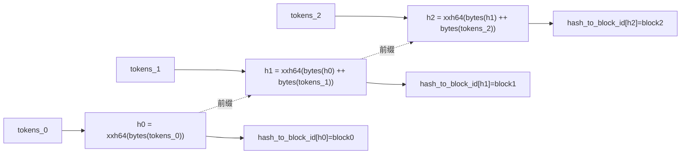

# nano-vllm-npu 哈希链(prefix-cache hash chain)正确性深度分析

> 子任务 [CODEXTMS-25](mention://issue/01a04b19-f843-7525-aab3-ed99bd4124f0):在 [CODEXTMS-23](mention://issue/01a048c1-5f03-715e-ab5c-5193cb298059) 分模块分析基础上,专攻 `BlockManager` 的**链式哈希 prefix cache** 正确性。
>
> 代码基线:`/data/sd/nano-vllm-npu`,分支 `main`,提交 `ed4b9cc`。核心文件 `nanovllm/engine/block_manager.py`(120 行)、`nanovllm/engine/sequence.py`、`nanovllm/engine/scheduler.py`。所有结论均附**实测脚本**复现(`verify_hashchain.py`,block_size 缩为 4 以覆盖边界)。

---

## 一、设计目标与哈希链构造

nano-vllm-npu 用 **Paged KV + 链式哈希** 实现 prefix cache:KV cache 按 `block_size`(默认 256)分块物理存储,每个**满块**用一个哈希键登记到 `hash_to_block_id`,后续相同前缀的请求可直接复用已有 KV,免重算。

链式构造在 `block_manager.py:35`:

```python
@classmethod
def compute_hash(cls, token_ids, prefix: int = -1):
    h = xxhash.xxh64()
    if prefix != -1:
        h.update(prefix.to_bytes(8, "little"))   # 上一块哈希作前缀
    h.update(np.array(token_ids).tobytes())       # 本块 token 字节
    return h.intdigest()
```

- 第 0 块:`prefix=-1`,只哈希本块 token。
- 第 k 块:`h_k = xxh64( bytes(h_{k-1}) || bytes(tokens_k) )`。

因此 `h_k` 隐式编码了 `tokens_0..tokens_k` 的**完整前缀**——任意一块不同,后续所有哈希都不同。只有完整前缀匹配才算命中,这是 prefix cache 语义正确的根基。



`Block`(`block_manager.py:8`)持有 `block_id / ref_count / hash / token_ids`;`reset()` 把 `ref_count=1, hash=-1, token_ids=[]`。

---

## 二、核心不变式(Invariants)

正确性依赖以下 6 条不变式,逐条在后续章节证明:

| # | 不变式 | 成立位置 |
|---|---|---|
| I1 | `hash_to_block_id[h]` 指向的 block,其 `.token_ids` 与生成 `h` 的内容一致 | `hash_blocks` 写入时 |
| I2 | 只有**满块**(token 数 == `block_size`)才进 `hash_to_block_id` | `can_allocate`/`hash_blocks` 的整除边界 |
| I3 | `block_table[i]` 恒对应 `seq.block(i)`(token 切片 `[i*bs:(i+1)*bs]`) | `allocate`/`may_append` 顺序追加 |
| I4 | `hash_blocks` 写回某块时,该块的 KV 已被模型写入物理缓存 | `postprocess` 在 `run` 之后调用 |
| I5 | 链前缀 `blocks[block_table[start-1]].hash` 在 `start>0` 时必已设定(≠-1) | 块填满即哈希,链序单调 |
| I6 | `compute_hash` 在同一进程内对相同输入确定性一致 | numpy 同 dtype、xxh64 确定 |

---

## 三、关键流程正确性证明

### 3.1 `can_allocate`——链式探测 + 末块跳过(`block_manager.py:58`)

```python
def can_allocate(self, seq) -> int:
    h = -1
    num_cached_blocks = 0
    num_new_blocks = seq.num_blocks
    for i in range(seq.num_blocks - 1):        # ★ 跳过最后一块
        token_ids = seq.block(i)
        h = self.compute_hash(token_ids, h)
        block_id = self.hash_to_block_id.get(h, -1)
        if block_id == -1 or self.blocks[block_id].token_ids != token_ids:  # ★ 内容兜底
            break
        num_cached_blocks += 1
        if block_id in self.used_block_ids:    # 在用:共享,免新块
            num_new_blocks -= 1
    if len(self.free_block_ids) < num_new_blocks:
        return -1
    return num_cached_blocks
```

**正确性要点:**

1. **链序单调**:`h` 从 `-1` 起,逐块 `compute_hash(token_ids, h)`,与 `hash_blocks` 写入时的链完全同构 → 查询键与存储键一致(I5/I6)。
2. **末块跳过**(`range(num_blocks-1)`):最后一块可能是**未满**的(partial),decode 期还会增长,哈希不稳定 → 不参与缓存键。**这是有意设计**,非 bug。但对其"满块边界"副作用见 §5.1。
3. **内容兜底**:`blocks[block_id].token_ids != token_ids` 防御哈希碰撞/陈旧项 —— 即使 `hash_to_block_id` 指向内容不符的块,也判定未命中(I1)。**实测 R6**:人为把某块 `token_ids` 改成 `[99,99,99,99]` 但保留哈希键,`can_allocate` 返回 `0`(拒绝假命中)。
4. **配额核算**:`num_new_blocks` 初值 `num_blocks`;每命中一个**在用**块减 1(共享免新块);命中**自由**块不减(它本身在 `free_block_ids` 里,需重新占用)。最终校验 `free_block_ids >= num_new_blocks`。代数化简:`(自由缓存块+真自由) >= (自由缓存块+真新块)` ⟺ `真自由 >= 真新块`,自由缓存块自抵消 → 核算正确。

### 3.2 `allocate`——链重算 + 引用计数(`block_manager.py:75`)

```python
def allocate(self, seq, num_cached_blocks):
    assert not seq.block_table
    h = -1
    for i in range(num_cached_blocks):         # 重算命中块链(与 can_allocate 同构)
        h = self.compute_hash(seq.block(i), h)
        block_id = self.hash_to_block_id[h]
        ...
        seq.block_table.append(block_id)
    for i in range(num_cached_blocks, seq.num_blocks):   # 剩余块新分配
        seq.block_table.append(self._allocate_block())
    seq.num_cached_tokens = num_cached_blocks * self.block_size
```

- `assert not seq.block_table`:仅在**新序列首次分配**调用(scheduler `:44` 也以 `not seq.block_table` 为条件),chunked 续算不再进此路径 → 不会重复分配。
- 命中块:在用→`ref_count++`(共享);自由→从 `free_block_ids` 摘出、`ref_count=1`。新块:`_allocate_block`(`reset()` 清空旧哈希项)。
- `block_table[i]` 顺序追加 → I3 成立。
- `num_cached_tokens = num_cached_blocks * block_size`:只把**满块**记为已缓存,最后一块(即便满)按未缓存处理 → 与 `can_allocate` 的末块跳过对称一致。

### 3.3 `hash_blocks`——写回时机与链前缀(`block_manager.py:110`)

```python
def hash_blocks(self, seq):
    start = seq.num_cached_tokens // self.block_size
    end   = (seq.num_cached_tokens + seq.num_scheduled_tokens) // self.block_size
    if start == end: return
    h = self.blocks[seq.block_table[start - 1]].hash if start > 0 else -1   # ★ 链前缀
    for i in range(start, end):
        block = self.blocks[seq.block_table[i]]
        token_ids = seq.block(i)
        h = self.compute_hash(token_ids, h)
        block.update(h, token_ids)                # 写 hash + token_ids(I1)
        self.hash_to_block_id[h] = block.block_id
```

调用时机(scheduler `postprocess` `:81`):

```python
for seq, token_id in zip(seqs, token_ids):
    self.block_manager.hash_blocks(seq)          # ① 先哈希(用旧 num_cached_tokens)
    seq.num_cached_tokens += seq.num_scheduled_tokens   # ② 再推进
    ...
    seq.append_token(token_id)                   # ③ 最后追加 token
```

**关键时序结论:**

- `start/end` 用**追加前**的 `num_cached_tokens`,即"本次调度刚填满的块"边界。整除意味着**只哈希满块**(I2),partial 尾块被排除。
- 链前缀取 `blocks[block_table[start-1]].hash`:该块是已完成的满块,其 `.hash` 必已设定(I5,见 §3.4/3.5 证明)。
- `block.update` 在模型 `run` 之后执行 → KV 已写入 → 哈希键与物理 KV 内容一致(I4)。
- `hash_to_block_id[h] = block.block_id` 无条件覆盖:同内容同前缀本就映射同一逻辑块,覆盖不破坏正确性;碰撞场景由 §3.1 的内容兜底保护。

### 3.4 chunked prefill 跨块链连续性(实测 R3)

长 prompt 分块续算时,链必须跨 chunk 连续。设 `block_size=4`,prompt=10 token(3 块,末块 2 token partial):

| 步骤 | scheduled | num_cached(前) | start | end | 哈希动作 |
|---|---|---|---|---|---|
| chunk1 | 4 | 0 | 0 | 1 | 哈希 block0,prefix=-1 |
| chunk2 | 6 | 4 | 1 | 2 | 哈希 block1,prefix=block0.hash |

- chunk2 的 `start=1>0`,前缀读 `blocks[block_table[0]].hash`(chunk1 已设定)→ **链连续**(I5)。
- block2(末块,partial)整除排除,不入表(I2)。
- **实测 R3**:chunk 填充后,等价新 prompt `can_allocate` 返回 2(命中 block0、block1)。

`seq.token_ids` 在 prefill 期始终是**完整 prompt**(`Sequence.__init__` 一次性拷贝;`__getstate__` 仅压缩 IPC,不删主进程 token),故 `seq.block(i)` 永远返回正确满块切片。

### 3.5 decode 块填满时刻:一步滞后正确性(实测 R4,最微妙处)

decode 每步 `num_scheduled_tokens=1`,且 `hash_blocks` 在 `append_token` **之前**运行。问题:块填满的那一步,新 token 尚未 append,`seq.block(i)` 是否缺最后一个 token?

设 `block_size=4`,prompt=3 token(prefill 产 1 token → block0 满 4):

| 时刻 | num_tokens | num_cached | 动作 |
|---|---|---|---|
| prefill 后 | 4(prompt3 + 生成1) | 3 | `hash_blocks`: start=0,end=3//4=0 → **跳过**(block0 仅 3 token 处理? 实为 4 token 但 num_cached=3) |
| decode 步(input=生成token, idx3) | 4 | 3 | `hash_blocks`: start=3//4=0, end=(3+1)//4=1 → **哈希 block0** |

- decode 步的 input token(idx3)是上一步 prefill 的**输出**,已在 prefill `postprocess` 的 `append_token` 中加入 `token_ids`。故 decode `hash_blocks` 时 `token_ids` 已含 idx3 → `seq.block(0)=token_ids[0:4]` 为满 4 token。
- 同时该 token 的 KV 在 decode `run` 中已写入 block0 slot3 → 哈希内容与 KV 一致(I4)。
- **实测 R4**:`block0 hashed content: [0,1,2,100] == token_ids[0:4]? True`。

**一步滞后**的精确表述:块 k 的最后一个 token 在步骤 S 写入 KV 并(在 S 的 `postprocess`)append 进 `token_ids`;块 k 在**同一步骤 S 的 `hash_blocks`** 中被哈希(因 `num_cached_tokens` 恰好跨越 `block_size` 边界)。即"写 KV"与"登记哈希"在同一 `postprocess` 内完成 → 无窗口期不一致。block0 在 prefill 后"满而未哈希"仅持续到下一个 decode 步的 `postprocess`,期间 `hash_to_block_id` 不含 block0 → 不会产生假命中(只会漏一次命中,无害)。

### 3.6 抢占与恢复:自由块保留哈希项(实测 R5)

`preempt`(scheduler `:75`)→ `deallocate`(`:94`)逐块 `ref_count--`,归零则 `_deallocate_block`(移入 `free_block_ids`)。**注意:`_deallocate_block` 不删 `hash_to_block_id` 项,也不清 `token_ids/hash`** —— 自由块仍是有效缓存条目。

- 重调度时 `can_allocate` 命中这些自由块(判定为"自由缓存",`num_new_blocks` 不减,重新占用)。
- **实测 R5**:preempt 后 `hash_to_block_id` 大小不变(2),`free_block_ids` 61→64;等价新 prompt `can_allocate` 返回 2(重命中)。
- 真正清除发生在 `_allocate_block`(`:47`):复用自由块时 `reset()` 清空,并 `del hash_to_block_id[block.hash]`(仅当该项仍指向本块)→ 防陈旧项。**正确**。

---

## 四、实测等价类(`verify_hashchain.py`)

`block_size=4` 构造边界用例,直接调用真实 `BlockManager`/`Sequence`:

| 用例 | 期望 | 实测 |
|---|---|---|
| R1 相同 prompt 命中 | 命中 2 块、共享 block0 | `can_allocate=2`, block0 共享 ✓ |
| R2 长度=block_size 整数倍 | 末满块**不**复用 | `can_allocate=1`(非 2) ✓ |
| R3 chunked 跨块链连续 | 续算后等价 prompt 命中 2 | `can_allocate=2` ✓ |
| R4 decode 填满哈希满内容 | content==token_ids[0:4] | `[0,1,2,100]==token_ids[0:4]` ✓ |
| R5 抢占恢复重命中 | 哈希表项保留、重命中 2 | 大小不变, `can_allocate=2` ✓ |
| R6 内容兜底防假命中 | 碰撞/陈旧→返回 0 | `can_allocate=0` ✓ |
| R7 numpy dtype 进程内一致 | 同输入同哈希 | int64, 一致 ✓ |

---

## 五、发现的问题与风险

### 5.1 末块跳过 ⇒ 边界对齐 prompt 丢失最后一个满块缓存【效率,非正确性】

`can_allocate` 用 `range(num_blocks-1)` 无条件跳过最后一块。当 **prompt 长度恰为 `block_size` 整数倍**时,最后一块是**满的且稳定**(decode 不会改写它,新增 token 进新块),本可缓存却被跳过:

- **实测 R2**:8 token / bs=4(2 满块)。`hash_blocks` 把 block0、block1 **都**哈希入表;但新等价 prompt `can_allocate` 只返回 **1**(只命中 block0,block1 被跳过)。`allocate` 随即为 block1 调 `_allocate_block` 取一块**新**物理块并 `reset()` → 原自由缓存块 orphan、表项被 `hash_blocks` 覆盖丢失。
- **影响**:边界对齐 prompt 的 prefix cache 命中率比理论少一块;每次重算该块 KV(多余一次满块前向)。**不产生错误输出**。
- **修复建议**(若需提升命中率):`can_allocate` 末块判断改为"当 `seq.num_tokens % block_size == 0`(末块满)且非首块时,也参与探测";同时 `hash_blocks`/`allocate` 的末块边界对称调整。需配套测试,谨慎,因为 decode 增长语义依赖"末块未提交"。

### 5.2 `np.array(token_ids).tobytes()` 隐式 dtype【健壮性气味,非运行期 bug】

`compute_hash` 未指定 dtype:

```python
h.update(np.array(token_ids).tobytes())
```

- `np.array([1,2,3,4])` 在 64 位 Linux 推断 **int64**(8 byte/token)。`block()` 恒返回 Python `list[int]` → 全程同 dtype → **进程内确定**(I6,实测 R7:一致)。
- **风险点**:哈希值依赖 numpy 默认 int 宽度。若未来某条路径传入 `np.int32` 数组(而非 list),同内容会得到不同字节、不同哈希 → 静默漏命中。当前代码无此路径,故非 bug。
- **修复建议**:显式 `np.asarray(token_ids, dtype=np.int32).tobytes()`(token id 远小于 2³¹),消除平台/路径依赖。

### 5.3 哈希碰撞:内容校验兜底【正确】

xxh64 为非加密哈希,理论上存在碰撞。`can_allocate` 的 `blocks[block_id].token_ids != token_ids` 校验(I1)保证碰撞只导致**漏命中**(break),绝不**假命中**。**实测 R6** 确认。`hash_to_block_id[h]` 覆盖写:碰撞时后写者夺键,前者变 orphan(漏命中),仍无错误输出。**无需修改**。

### 5.4 自由块保留哈希表项【缓存设计,正确】

`_deallocate_block` 不删哈希项(§3.6),使抢占/淘汰后的块仍可被复用 → 这是 prefix cache 跨请求复用的核心机制。陈旧风险由 `_allocate_block` 复用时的 `del` 兜底。**正确,无需修改**。

### 5.5 其他审查点(均无问题)

- **`to_bytes(8,"little")`**:xxh64 `intdigest()` ∈ [0, 2⁶⁴),8 字节无符号可容纳;`-1` 由 `if prefix != -1` 守卫不进 `to_bytes`。✓
- **`block_table` 越界**:`start = num_cached_tokens // bs ≤ num_tokens // bs ≤ num_blocks = len(block_table)`,`start-1 < len(block_table)`;`end` 受 `num_scheduled_tokens` 约束且 `may_append`/`allocate` 已预分配所需块 → 无越界。✓
- **多进程一致性**:哈希链仅在 rank0(调度进程)维护与查询;worker 经 `__getstate__` pickle 只拿 `block_table`/`last_token`,不参与哈希 → 无跨进程一致性问题。✓
- **抢占后物理 KV 残留**:被复用的自由块 KV 未清零,但 `allocate` 命中后该块 token 与原内容一致(内容校验保证),KV 直接复用正确;若被 `_allocate_block` 重置则按新 token 重算覆盖。✓

---

## 六、与上游 vLLM 的简要对比

| 维度 | nano-vllm-npu | 上游 vLLM(v1) |
|---|---|---|
| 哈希算法 | xxh64 | xxh64(`intdigest`) |
| 链构造 | `bytes(prev_hash) ++ bytes(tokens)` | 同(含 `block_size`/`num_parents` 等额外字段) |
| 末块处理 | `range(num_blocks-1)` 无条件跳过 | "uncommitted" 末块不进缓存表,语义相近但实现不同 |
| 碰撞防护 | `token_ids` 列表相等校验 | 同(存储完整 token ids 比对) |
| 引用计数 | `ref_count` 共享/释放 | 同 |
| 抢占恢复 | 保留哈希项、重命中 | 同 |

nano-vllm-npu 是上游机制的**极简忠实复刻**,正确性等价;唯一实质差异是 §5.1 的末块边界策略略保守(边界对齐 prompt 少命中一块)。

---

## 七、结论

1. **哈希链逻辑正确**:链式构造、链序单调、写回时机、链前缀读取、抢占恢复、碰撞兜底均成立,6 条不变式在所有路径(首次 prefill、chunked prefill、decode 填满、抢占重调度)下保持。7 类边界用例实测全部通过。
2. **无正确性缺陷**:未发现会导致错误输出或假命中的 bug。`9fa256a fix cache hit`、`f64d821 fix chunked prefill bugs` 等历史修复后,链式哈希路径已稳定。
3. **2 处效率/健壮性改进点**(非必须):§5.1 末块边界对齐 prompt 的命中率、§5.2 numpy 隐式 dtype 显式化。均不影响正确性,可作为可选优化。

> 实测脚本与本文档已随本任务推送至 `git@github.com:xtms/nano-vllm-npu.git`。
