## nano-vllm-npu 分模块分析(流程图 / 时序图 / 类图)

延续 [CODEXTMS-22](mention://issue/01a048bd-0e1b-7d62-a7bd-32732cdad9e0) 的整体架构,本篇按 **入口层 → 引擎层 → 计算层 → 基础设施层** 逐模块给出业务流程图、时序图、类图。代码位于 `/data/sd/nano-vllm-npu`,分支 `main`,提交 `4f6d847`。图用 Mermaid 绘制。

---

## 〇、整体类图(分层全景)

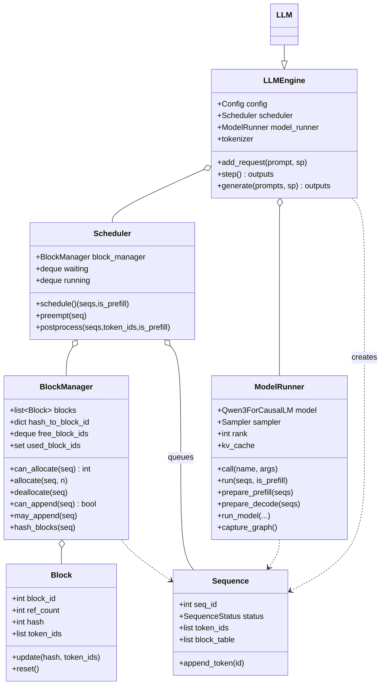
```mermaid
classDiagram
  class LLM
  class LLMEngine {
    +Config config
    +Scheduler scheduler
    +ModelRunner model_runner
    +tokenizer
    +add_request(prompt, sp)
    +step() outputs
    +generate(prompts, sp) outputs
  }
  class Scheduler {
    +BlockManager block_manager
    +deque waiting
    +deque running
    +schedule() (seqs,is_prefill)
    +preempt(seq)
    +postprocess(seqs,token_ids,is_prefill)
  }
  class BlockManager {
    +list~Block~ blocks
    +dict hash_to_block_id
    +deque free_block_ids
    +set used_block_ids
    +can_allocate(seq) int
    +allocate(seq, n)
    +deallocate(seq)
    +can_append(seq) bool
    +may_append(seq)
    +hash_blocks(seq)
  }
  class Block {
    +int block_id
    +int ref_count
    +int hash
    +list token_ids
    +update(hash, token_ids)
    +reset()
  }
  class ModelRunner {
    +Qwen3ForCausalLM model
    +Sampler sampler
    +int rank
    +kv_cache
    +call(name, args)
    +run(seqs, is_prefill)
    +prepare_prefill(seqs)
    +prepare_decode(seqs)
    +run_model(...)
    +capture_graph()
  }
  class Sequence {
    +int seq_id
    +SequenceStatus status
    +list token_ids
    +list block_table
    +append_token(id)
  }
  LLM --|> LLMEngine
  LLMEngine o-- Scheduler
  LLMEngine o-- ModelRunner
  LLMEngine ..> Sequence : creates
  Scheduler o-- BlockManager
  Scheduler o-- Sequence : queues
  BlockManager o-- Block
  BlockManager ..> Sequence
  ModelRunner ..> Sequence
```

四层职责:入口层(`LLM`/`run_api_server.py`)只暴露接口;引擎层做调度与执行分离;计算层是纯模型定义,通过 `Context` 单例隐式拿 batch 元数据;基础设施层把设备差异/编译开关收敛到 utils。

---

## 一、入口层:LLM / API Server

### 1.1 类图

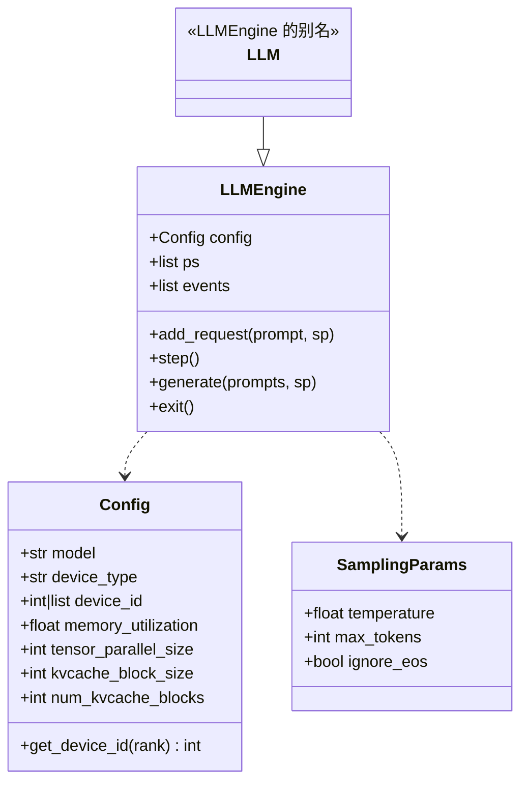
```mermaid
classDiagram
  class LLM {
    <<LLMEngine 的别名>>
  }
  class LLMEngine {
    +Config config
    +list ps
    +list events
    +add_request(prompt, sp)
    +step()
    +generate(prompts, sp)
    +exit()
  }
  class Config {
    +str model
    +str device_type
    +int|list device_id
    +float memory_utilization
    +int tensor_parallel_size
    +int kvcache_block_size
    +int num_kvcache_blocks
    +get_device_id(rank) int
  }
  class SamplingParams {
    +float temperature
    +int max_tokens
    +bool ignore_eos
  }
  LLM --|> LLMEngine
  LLMEngine ..> Config
  LLMEngine ..> SamplingParams
```

`llm.py:4` 中 `LLM(LLMEngine): pass`,`LLM` 仅是别名。`run_api_server.py` 基于 FastAPI 提供 `/v1/completions`、`/v1/chat/completions`,每次请求阻塞调 `llm.generate`(`run_api_server.py:102`)。

### 1.2 业务流程图(API Server)

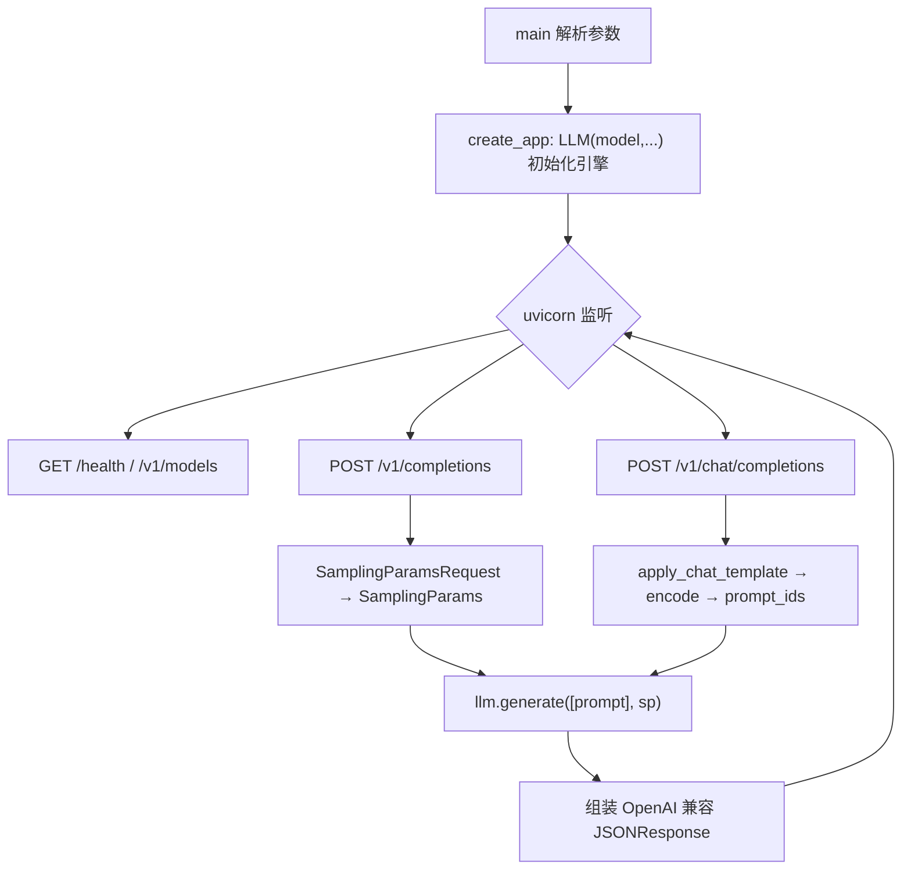
```mermaid
flowchart TD
  A["main 解析参数"] --> B["create_app: LLM(model,...) 初始化引擎"]
  B --> C{"uvicorn 监听"}
  C --> D["GET /health / /v1/models"]
  C --> E["POST /v1/completions"]
  C --> F["POST /v1/chat/completions"]
  E --> G["SamplingParamsRequest → SamplingParams"]
  F --> H["apply_chat_template → encode → prompt_ids"]
  G --> I["llm.generate([prompt], sp)"]
  H --> I
  I --> J["组装 OpenAI 兼容 JSONResponse"]
  J --> C
```

注:服务化是**同步非流式**,单请求阻塞,无跨请求连续批处理。

---

## 二、引擎层

### 2.1 LLMEngine —— 生成主循环

#### 2.1.1 业务流程图(generate 生命周期)

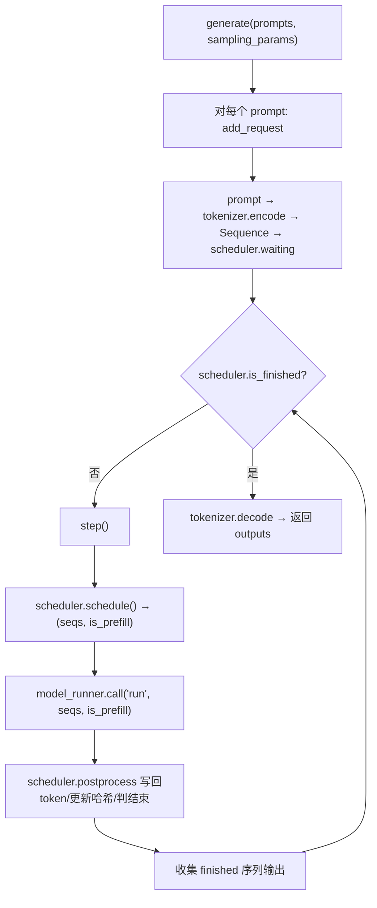
```mermaid
flowchart TD
  A["generate(prompts, sampling_params)"] --> B["对每个 prompt: add_request"]
  B --> C["prompt → tokenizer.encode → Sequence → scheduler.waiting"]
  C --> D{"scheduler.is_finished?"}
  D -- 否 --> E["step()"]
  E --> F["scheduler.schedule() → (seqs, is_prefill)"]
  F --> G["model_runner.call('run', seqs, is_prefill)"]
  G --> H["scheduler.postprocess 写回token/更新哈希/判结束"]
  H --> I["收集 finished 序列输出"]
  I --> D
  D -- 是 --> J["tokenizer.decode → 返回 outputs"]
```

#### 2.1.2 时序图(step —— 调度+多进程执行)

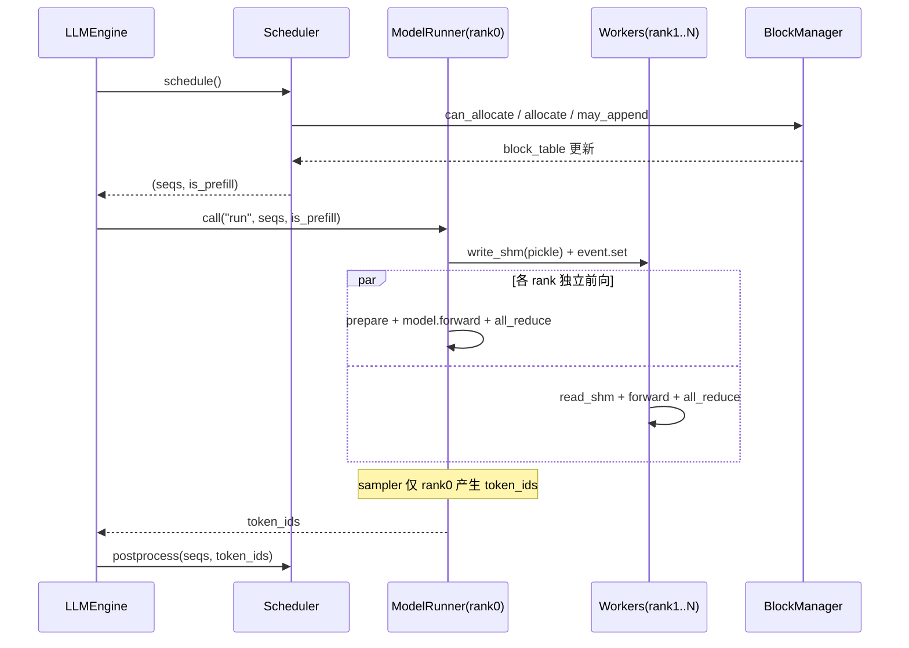
```mermaid
sequenceDiagram
  participant U as LLMEngine
  participant S as Scheduler
  participant MR0 as ModelRunner(rank0)
  participant MRn as Workers(rank1..N)
  participant BM as BlockManager
  U->>S: schedule()
  S->>BM: can_allocate / allocate / may_append
  BM-->>S: block_table 更新
  S-->>U: (seqs, is_prefill)
  U->>MR0: call("run", seqs, is_prefill)
  MR0->>MRn: write_shm(pickle) + event.set
  par 各 rank 独立前向
    MR0->>MR0: prepare + model.forward + all_reduce
  and
    MRn->>MRn: read_shm + forward + all_reduce
  end
  Note over MR0: sampler 仅 rank0 产生 token_ids
  MR0-->>U: token_ids
  U->>S: postprocess(seqs, token_ids)
```

关键点:同一进程负责调度,多进程负责执行;worker 在 `loop()`(`model_runner.py:84`)阻塞读共享内存。`Sequence.__getstate__`(`sequence.py:72`)定制 pickle:prefill 传完整 token_ids,decode 只传 `last_token`,压低 IPC 负载。

#### 2.1.3 初始化时序图

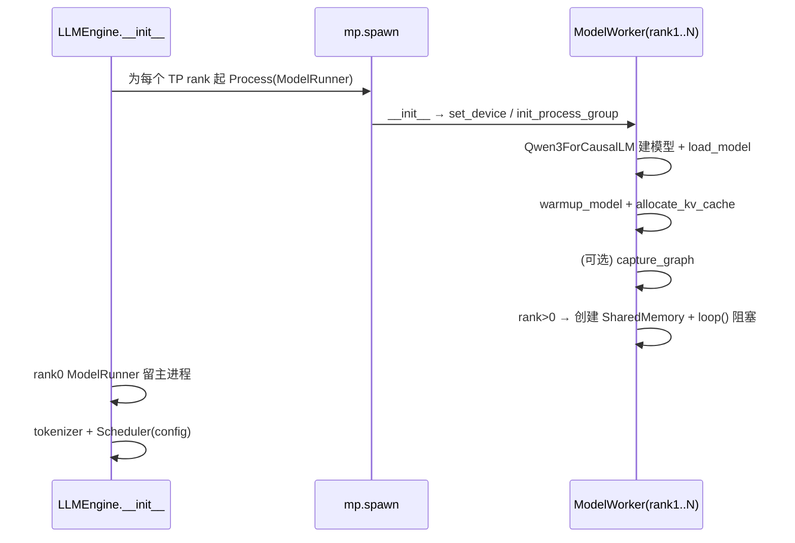
```mermaid
sequenceDiagram
  participant E as LLMEngine.__init__
  participant Ctx as mp.spawn
  participant W as ModelWorker(rank1..N)
  E->>Ctx: 为每个 TP rank 起 Process(ModelRunner)
  Ctx->>W: __init__ → set_device / init_process_group
  W->>W: Qwen3ForCausalLM 建模型 + load_model
  W->>W: warmup_model + allocate_kv_cache
  W->>W: (可选) capture_graph
  W->>W: rank>0 → 创建 SharedMemory + loop() 阻塞
  E->>E: rank0 ModelRunner 留主进程
  E->>E: tokenizer + Scheduler(config)
```

---

### 2.2 Scheduler —— 两阶段调度

#### 2.2.1 业务流程图(schedule:prefill 优先 + decode 次之)

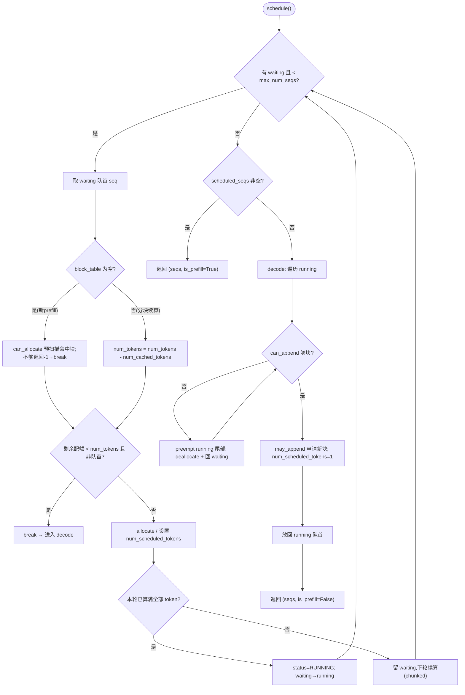
```mermaid
flowchart TD
  Start(["schedule()"]) --> P{"有 waiting 且 < max_num_seqs?"}
  P -- 是 --> P1["取 waiting 队首 seq"]
  P1 --> P2{"block_table 为空?"}
  P2 -- "是(新prefill)" --> P3["can_allocate 预扫描命中块;不够返回-1→break"]
  P2 -- "否(分块续算)" --> P4["num_tokens = num_tokens - num_cached_tokens"]
  P3 --> P5{"剩余配额 < num_tokens 且 非队首?"}
  P4 --> P5
  P5 -- 是 --> Break1["break → 进入 decode"]
  P5 -- 否 --> P6["allocate / 设置 num_scheduled_tokens"]
  P6 --> P7{"本轮已算满全部 token?"}
  P7 -- 是 --> P8["status=RUNNING; waiting→running"]
  P7 -- 否 --> P9["留 waiting,下轮续算(chunked)"]
  P8 --> P
  P9 --> P
  P -- 否 --> D{"scheduled_seqs 非空?"}
  D -- 是 --> Ret1["返回 (seqs, is_prefill=True)"]
  D -- 否 --> Dec["decode: 遍历 running"]
  Dec --> D1{"can_append 够块?"}
  D1 -- 否 --> D2["preempt running 尾部: deallocate + 回 waiting"]
  D2 --> D1
  D1 -- 是 --> D3["may_append 申请新块; num_scheduled_tokens=1"]
  D3 --> D4["放回 running 队首"]
  D4 --> Ret2["返回 (seqs, is_prefill=False)"]
```

核心策略:
- **Chunked prefill**:仅队首长 prompt 可分块(`scheduler.py:42`),后续短序列整批拼同一 batch。
- **Continuous batching**:无 prefill 时,running 队列每序列取 1 token 组 decode batch。
- **抢占**(`preempt`,`scheduler.py:75`):KV 块不足时 LRU 弹出 running 尾部序列,deallocate 全部块,回 waiting 重算。

#### 2.2.2 时序图(postprocess 写回)

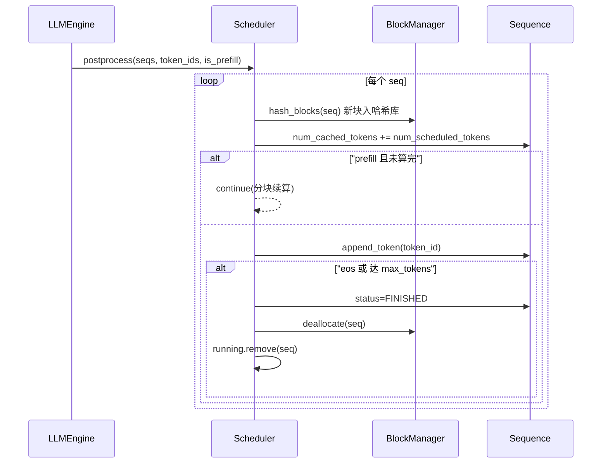
```mermaid
sequenceDiagram
  participant E as LLMEngine
  participant S as Scheduler
  participant BM as BlockManager
  participant Seq as Sequence
  E->>S: postprocess(seqs, token_ids, is_prefill)
  loop 每个 seq
    S->>BM: hash_blocks(seq) 新块入哈希库
    S->>Seq: num_cached_tokens += num_scheduled_tokens
    alt "prefill 且未算完"
      S-->>S: continue(分块续算)
    else
      S->>Seq: append_token(token_id)
      alt "eos 或 达 max_tokens"
        S->>Seq: status=FINISHED
        S->>BM: deallocate(seq)
        S->>S: running.remove(seq)
      end
    end
  end
```

---

### 2.3 BlockManager —— Paged KV + 哈希链 Prefix Cache

#### 2.3.1 类图

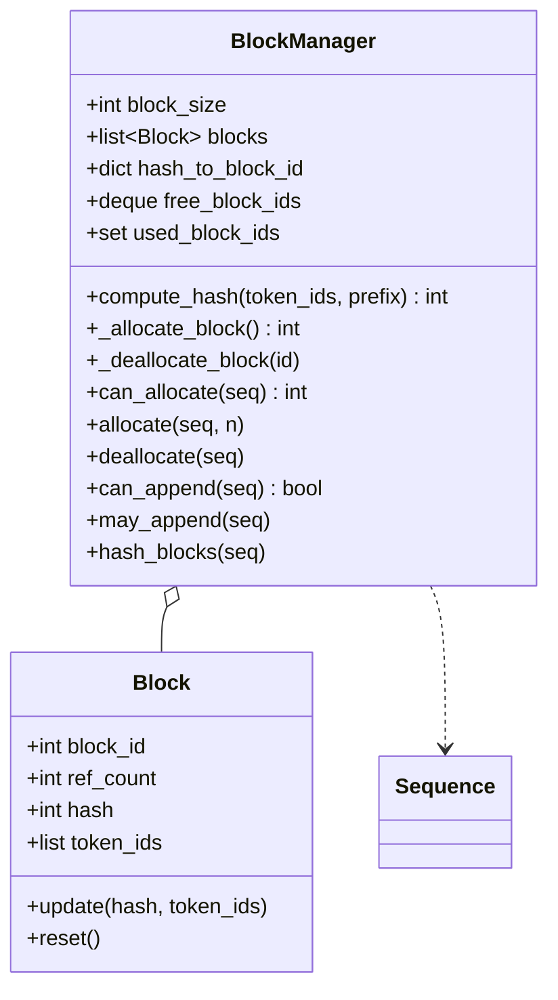
```mermaid
classDiagram
  class Block {
    +int block_id
    +int ref_count
    +int hash
    +list token_ids
    +update(hash, token_ids)
    +reset()
  }
  class BlockManager {
    +int block_size
    +list~Block~ blocks
    +dict hash_to_block_id
    +deque free_block_ids
    +set used_block_ids
    +compute_hash(token_ids, prefix) int
    +_allocate_block() int
    +_deallocate_block(id)
    +can_allocate(seq) int
    +allocate(seq, n)
    +deallocate(seq)
    +can_append(seq) bool
    +may_append(seq)
    +hash_blocks(seq)
  }
  BlockManager o-- Block
  BlockManager ..> Sequence
```

物理 KV 结构:`kv_cache = torch.empty(2, num_layers, num_blocks, block_size, num_kv_heads, head_dim)`(`model_runner.py:138`),`block_size=256`。`compute_hash`(`block_manager.py:35`)用 xxhash,把上一块哈希作前缀 → **链式哈希**,只有完整前缀匹配才算命中。

#### 2.3.2 业务流程图(prefix cache 命中与分配)

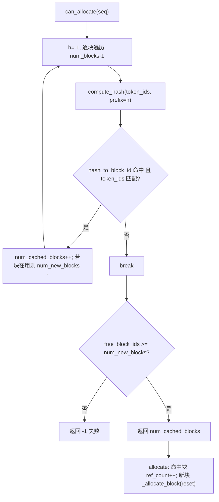
```mermaid
flowchart TD
  A["can_allocate(seq)"] --> B["h=-1, 逐块遍历 num_blocks-1"]
  B --> C["compute_hash(token_ids, prefix=h)"]
  C --> D{"hash_to_block_id 命中 且 token_ids 匹配?"}
  D -- 是 --> E["num_cached_blocks++; 若块在用则 num_new_blocks--"]
  E --> B
  D -- 否 --> F["break"]
  F --> G{"free_block_ids >= num_new_blocks?"}
  G -- 否 --> H["返回 -1 失败"]
  G -- 是 --> I["返回 num_cached_blocks"]
  I --> J["allocate: 命中块 ref_count++; 新块 _allocate_block(reset)"]
```

#### 2.3.3 时序图(allocate 命中+新增块)

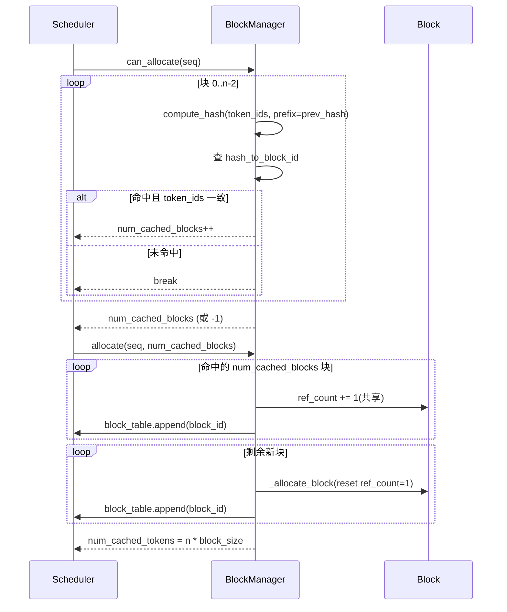
```mermaid
sequenceDiagram
  participant S as Scheduler
  participant BM as BlockManager
  participant B as Block
  S->>BM: can_allocate(seq)
  loop 块 0..n-2
    BM->>BM: compute_hash(token_ids, prefix=prev_hash)
    BM->>BM: 查 hash_to_block_id
    alt 命中且 token_ids 一致
      BM-->>S: num_cached_blocks++
    else 未命中
      BM-->>S: break
    end
  end
  BM-->>S: num_cached_blocks (或 -1)
  S->>BM: allocate(seq, num_cached_blocks)
  loop 命中的 num_cached_blocks 块
    BM->>B: ref_count += 1(共享)
    BM->>S: block_table.append(block_id)
  end
  loop 剩余新块
    BM->>B: _allocate_block(reset ref_count=1)
    BM->>S: block_table.append(block_id)
  end
  BM-->>S: num_cached_tokens = n * block_size
```

引用计数:多序列共享同一 prefix 块;`deallocate` 递减,归零才真正释放。

---

### 2.4 ModelRunner —— 执行器

#### 2.4.1 业务流程图(run:prepare → 前向 → 采样)

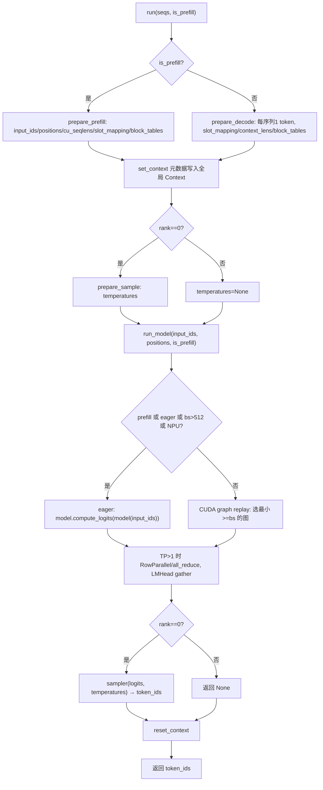
```mermaid
flowchart TD
  A["run(seqs, is_prefill)"] --> B{"is_prefill?"}
  B -- 是 --> C["prepare_prefill: input_ids/positions/cu_seqlens/slot_mapping/block_tables"]
  B -- 否 --> D["prepare_decode: 每序列1 token, slot_mapping/context_lens/block_tables"]
  C --> E["set_context 元数据写入全局 Context"]
  D --> E
  E --> F{"rank==0?"}
  F -- 是 --> G["prepare_sample: temperatures"]
  F -- 否 --> H["temperatures=None"]
  G --> I["run_model(input_ids, positions, is_prefill)"]
  H --> I
  I --> J{"prefill 或 eager 或 bs>512 或 NPU?"}
  J -- 是 --> K["eager: model.compute_logits(model(input_ids))"]
  J -- 否 --> L["CUDA graph replay: 选最小 >=bs 的图"]
  K --> M["TP>1 时 RowParallel/all_reduce, LMHead gather"]
  L --> M
  M --> N{"rank==0?"}
  N -- 是 --> O["sampler(logits, temperatures) → token_ids"]
  N -- 否 --> P["返回 None"]
  O --> Q["reset_context"]
  P --> Q
  Q --> R["返回 token_ids"]
```

#### 2.4.2 时序图(TP 多进程通信 —— SharedMemory + Event)

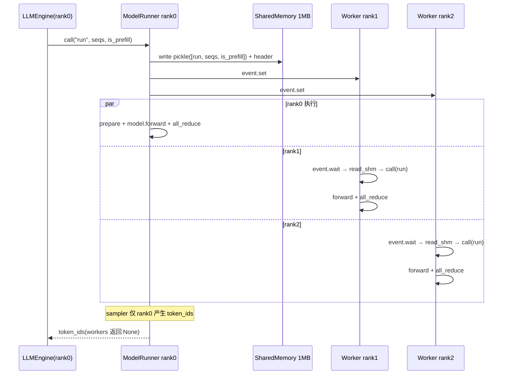
```mermaid
sequenceDiagram
  participant E as LLMEngine(rank0)
  participant MR0 as ModelRunner rank0
  participant SHM as SharedMemory 1MB
  participant W1 as Worker rank1
  participant W2 as Worker rank2
  E->>MR0: call("run", seqs, is_prefill)
  MR0->>SHM: write pickle([run, seqs, is_prefill]) + header
  MR0->>W1: event.set
  MR0->>W2: event.set
  par rank0 执行
    MR0->>MR0: prepare + model.forward + all_reduce
  and rank1
    W1->>W1: event.wait → read_shm → call(run)
    W1->>W1: forward + all_reduce
  and rank2
    W2->>W2: event.wait → read_shm → call(run)
    W2->>W2: forward + all_reduce
  end
  Note over MR0: sampler 仅 rank0 产生 token_ids
  MR0-->>E: token_ids(workers 返回 None)
```

#### 2.4.3 业务流程图(KV cache 容量自测 + 图捕获)

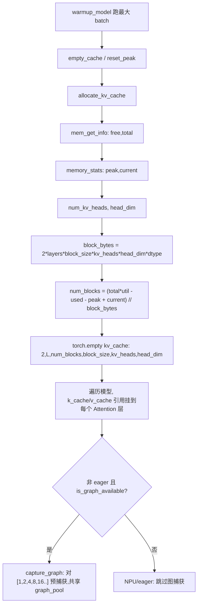
```mermaid
flowchart TD
  A["warmup_model 跑最大 batch"] --> B["empty_cache / reset_peak"]
  B --> C["allocate_kv_cache"]
  C --> D["mem_get_info: free,total"]
  D --> E["memory_stats: peak,current"]
  E --> F["num_kv_heads, head_dim"]
  F --> G["block_bytes = 2*layers*block_size*kv_heads*head_dim*dtype"]
  G --> H["num_blocks = (total*util - used - peak + current) // block_bytes"]
  H --> I["torch.empty kv_cache: 2,L,num_blocks,block_size,kv_heads,head_dim"]
  I --> J["遍历模型, k_cache/v_cache 引用挂到每个 Attention 层"]
  J --> K{"非 eager 且 is_graph_available?"}
  K -- 是 --> L["capture_graph: 对 [1,2,4,8,16..] 预捕获,共享 graph_pool"]
  K -- 否 --> M["NPU/eager: 跳过图捕获"]
```

---

### 2.5 Sequence —— 状态机

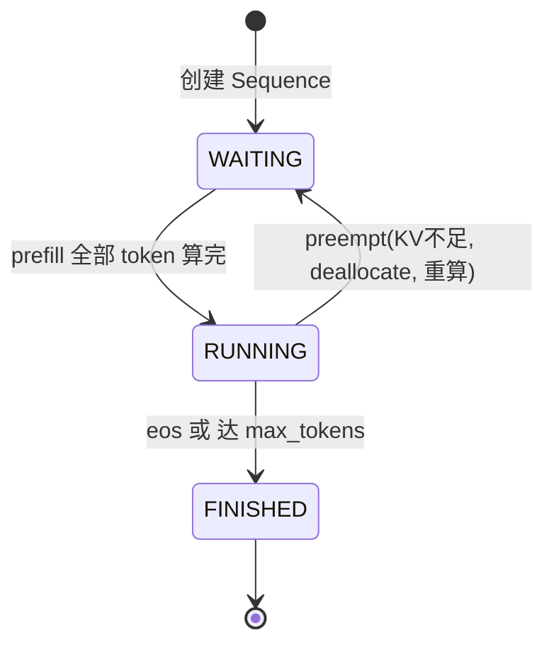
```mermaid
stateDiagram-v2
  [*] --> WAITING: 创建 Sequence
  WAITING --> RUNNING: prefill 全部 token 算完
  RUNNING --> FINISHED: eos 或 达 max_tokens
  RUNNING --> WAITING: preempt(KV不足, deallocate, 重算)
  FINISHED --> [*]
```

`SequenceStatus` 枚举:`WAITING / RUNNING / FINISHED`(`sequence.py:8`)。`block_size`/`counter` 为类属性;`__getstate__` 定制 pickle 压低 IPC 负载。

---

## 三、计算层

### 3.1 Qwen3ForCausalLM —— 模型类图

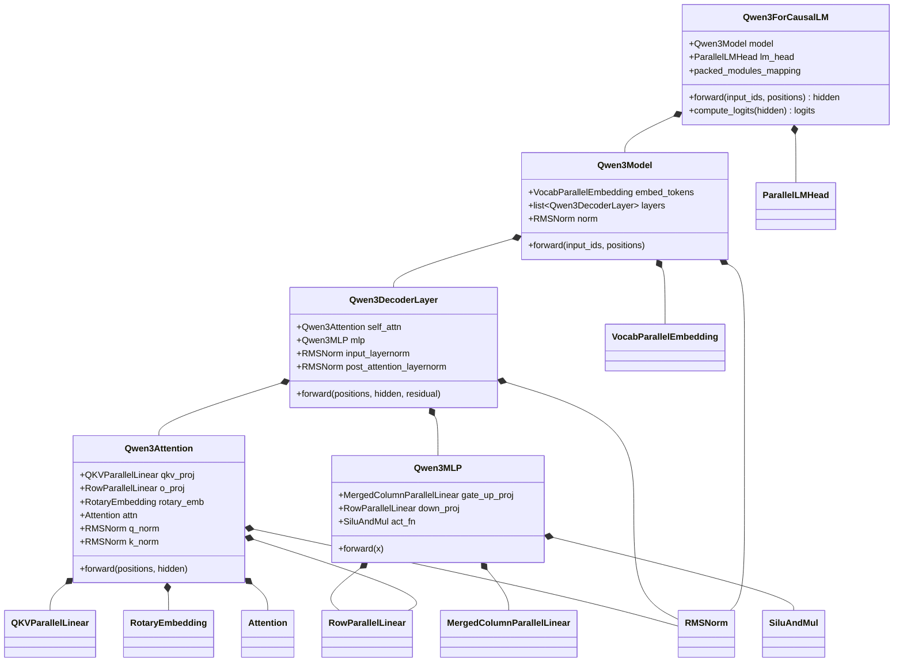
```mermaid
classDiagram
  class Qwen3ForCausalLM {
    +Qwen3Model model
    +ParallelLMHead lm_head
    +packed_modules_mapping
    +forward(input_ids, positions) hidden
    +compute_logits(hidden) logits
  }
  class Qwen3Model {
    +VocabParallelEmbedding embed_tokens
    +list~Qwen3DecoderLayer~ layers
    +RMSNorm norm
    +forward(input_ids, positions)
  }
  class Qwen3DecoderLayer {
    +Qwen3Attention self_attn
    +Qwen3MLP mlp
    +RMSNorm input_layernorm
    +RMSNorm post_attention_layernorm
    +forward(positions, hidden, residual)
  }
  class Qwen3Attention {
    +QKVParallelLinear qkv_proj
    +RowParallelLinear o_proj
    +RotaryEmbedding rotary_emb
    +Attention attn
    +RMSNorm q_norm
    +RMSNorm k_norm
    +forward(positions, hidden)
  }
  class Qwen3MLP {
    +MergedColumnParallelLinear gate_up_proj
    +RowParallelLinear down_proj
    +SiluAndMul act_fn
    +forward(x)
  }
  Qwen3ForCausalLM *-- Qwen3Model
  Qwen3ForCausalLM *-- ParallelLMHead
  Qwen3Model *-- VocabParallelEmbedding
  Qwen3Model *-- Qwen3DecoderLayer
  Qwen3Model *-- RMSNorm
  Qwen3DecoderLayer *-- Qwen3Attention
  Qwen3DecoderLayer *-- Qwen3MLP
  Qwen3DecoderLayer *-- RMSNorm
  Qwen3Attention *-- QKVParallelLinear
  Qwen3Attention *-- RowParallelLinear
  Qwen3Attention *-- RotaryEmbedding
  Qwen3Attention *-- Attention
  Qwen3Attention *-- RMSNorm
  Qwen3MLP *-- MergedColumnParallelLinear
  Qwen3MLP *-- RowParallelLinear
  Qwen3MLP *-- SiluAndMul
```

`packed_modules_mapping`(`qwen3.py:187`)告诉 `loader.py` 把 HF 权重 `q_proj/k_proj/v_proj` 合并进 `qkv_proj`、`gate_proj/up_proj` 合并进 `gate_up_proj`。

#### 3.1.1 业务流程图(DecoderLayer 前向 + 残差)

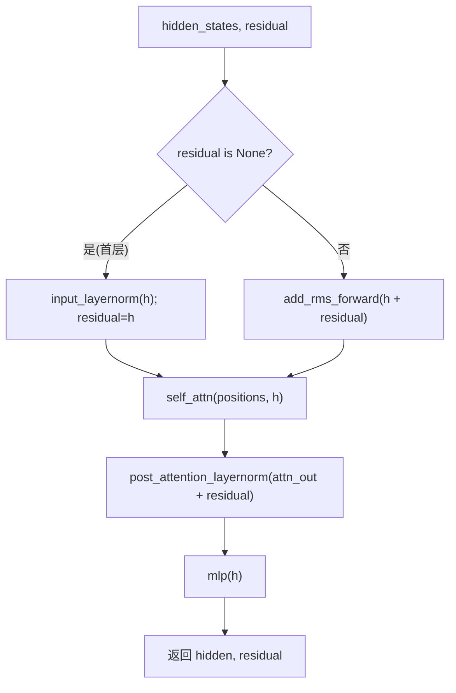
```mermaid
flowchart TD
  H["hidden_states, residual"] --> R1{"residual is None?"}
  R1 -- "是(首层)" --> R1a["input_layernorm(h); residual=h"]
  R1 -- 否 --> R1b["add_rms_forward(h + residual)"]
  R1a --> A["self_attn(positions, h)"]
  R1b --> A
  A --> R2["post_attention_layernorm(attn_out + residual)"]
  R2 --> M["mlp(h)"]
  M --> Out["返回 hidden, residual"]
```

---

### 3.2 Attention —— 双路径(flash / SDPA 回退)

#### 3.2.1 业务流程图(prefill×decode × flash×sdpa 四象限)

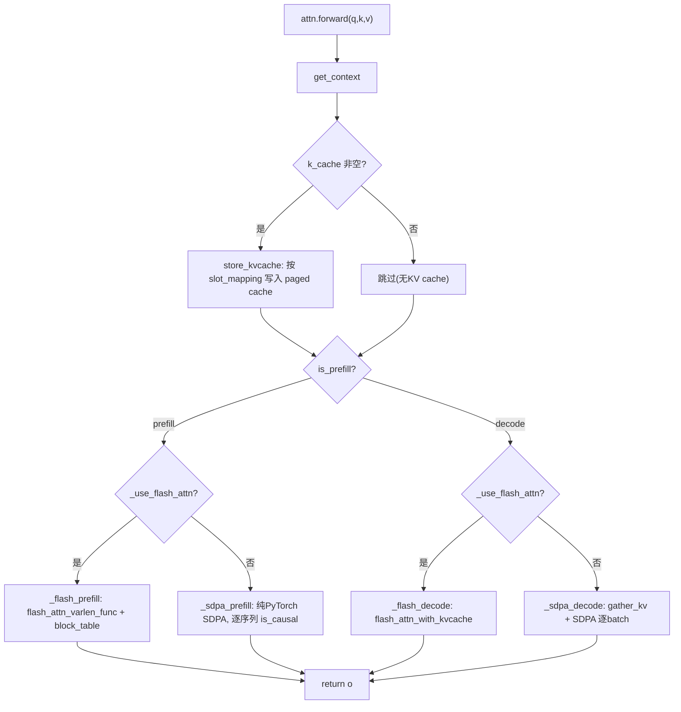
```mermaid
flowchart TD
  A["attn.forward(q,k,v)"] --> B["get_context"]
  B --> C{"k_cache 非空?"}
  C -- 是 --> D["store_kvcache: 按 slot_mapping 写入 paged cache"]
  C -- 否 --> E["跳过(无KV cache)"]
  D --> F{"is_prefill?"}
  E --> F
  F -- prefill --> G{"_use_flash_attn?"}
  G -- 是 --> H["_flash_prefill: flash_attn_varlen_func + block_table"]
  G -- 否 --> I["_sdpa_prefill: 纯PyTorch SDPA, 逐序列 is_causal"]
  F -- decode --> J{"_use_flash_attn?"}
  J -- 是 --> K["_flash_decode: flash_attn_with_kvcache"]
  J -- 否 --> L["_sdpa_decode: gather_kv + SDPA 逐batch"]
  H --> Z["return o"]
  I --> Z
  K --> Z
  L --> Z
```

构造时探测 `flash_attn` 是否可用(`attention.py:87`);NPU/无 flash 走 SDPA 回退。`store_kvcache`(`attention.py:8`)是纯 PyTorch 索引(去掉了原 Triton 版本),NPU 兼容。GQA:`num_heads > num_kv_heads` 时 `repeat_interleave` 扩展 KV 头(`attention.py:160`)。

#### 3.2.2 时序图(SDPA decode 回退路径)

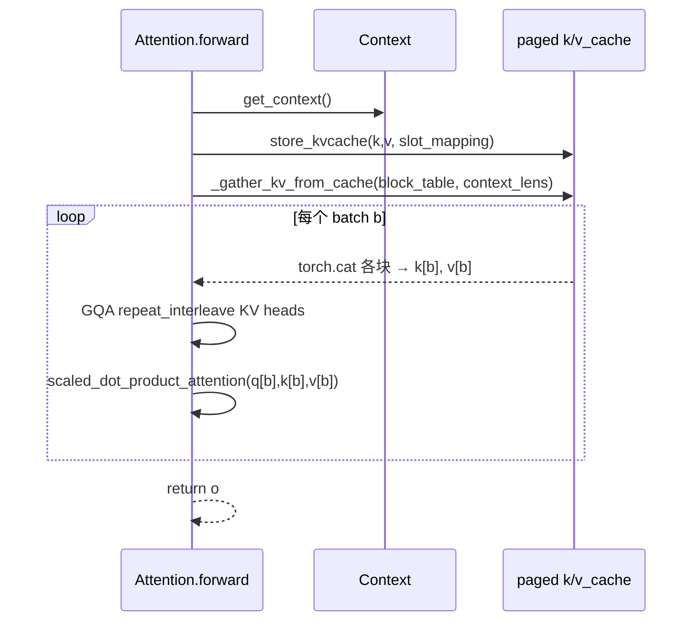
```mermaid
sequenceDiagram
  participant Attn as Attention.forward
  participant Ctx as Context
  participant KC as paged k/v_cache
  Attn->>Ctx: get_context()
  Attn->>KC: store_kvcache(k,v, slot_mapping)
  Attn->>KC: _gather_kv_from_cache(block_table, context_lens)
  loop 每个 batch b
    KC-->>Attn: torch.cat 各块 → k[b], v[b]
    Attn->>Attn: GQA repeat_interleave KV heads
    Attn->>Attn: scaled_dot_product_attention(q[b],k[b],v[b])
  end
  Attn-->>Attn: return o
```

注:SDPA 路径含 Python 双重循环(`for b: for block_idx`),大 batch 下是性能瓶颈,这是为 NPU 兼容性付出的代价。

---

### 3.3 张量并行 Linear —— 类图

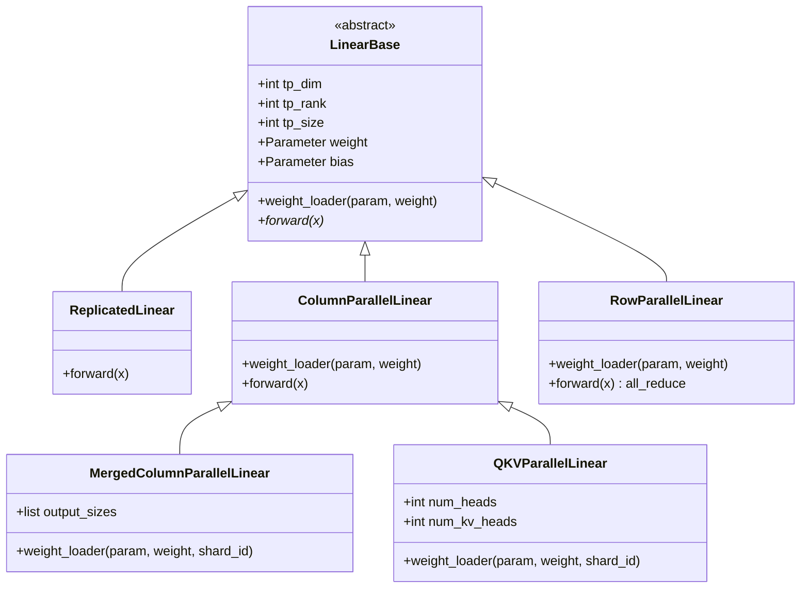
```mermaid
classDiagram
  class LinearBase {
    <<abstract>>
    +int tp_dim
    +int tp_rank
    +int tp_size
    +Parameter weight
    +Parameter bias
    +weight_loader(param, weight)
    +forward(x)*
  }
  class ReplicatedLinear {
    +forward(x)
  }
  class ColumnParallelLinear {
    +weight_loader(param, weight)
    +forward(x)
  }
  class MergedColumnParallelLinear {
    +list output_sizes
    +weight_loader(param, weight, shard_id)
  }
  class QKVParallelLinear {
    +int num_heads
    +int num_kv_heads
    +weight_loader(param, weight, shard_id)
  }
  class RowParallelLinear {
    +weight_loader(param, weight)
    +forward(x) all_reduce
  }
  LinearBase <|-- ReplicatedLinear
  LinearBase <|-- ColumnParallelLinear
  ColumnParallelLinear <|-- MergedColumnParallelLinear
  ColumnParallelLinear <|-- QKVParallelLinear
  LinearBase <|-- RowParallelLinear
```

#### 3.3.1 业务流程图(Column vs Row 并行)

```mermaid
flowchart LR
  subgraph Col["ColumnParallel / QKV / Merged gate_up"]
    direction TB
    C1["输入 x 各rank相同"] --> C2["F.linear(x, weight_shard)"]
    C2 --> C3["各 rank 输出一段, 无需 all_reduce"]
  end
  subgraph Row["RowParallel / o_proj / down_proj"]
    direction TB
    R1["输入 x 各rank不同段"] --> R2["F.linear(x, weight_shard)"]
    R2 --> R3["dist.all_reduce 汇聚"]
    R3 --> R4["各 rank 输出相同"]
  end
```

标准 Megatron-LM 式 TP:ColumnParallel 输出维切分(无 all_reduce),RowParallel 输入维切分(末尾 all_reduce)。`QKVParallelLinear` 把 q/k/v 打包成一个矩阵,各自按头数切(`linear.py:96`)。`MergedColumnParallelLinear` gate/up 合并,加载时按 shard_id 填偏移。

---

### 3.4 Embedding / LMHead

#### 3.4.1 业务流程图

```mermaid
flowchart TD
  E["VocabParallelEmbedding.forward(x)"]
  E --> E1{"tp_size>1?"}
  E1 -- 是 --> E2["mask 非本rank词表置零; F.embedding; all_reduce"]
  E1 -- 否 --> E3["F.embedding"]
  E2 --> OutE["输出"]
  E3 --> OutE
  H["ParallelLMHead.forward(x)"]
  H --> H1{"is_prefill?"}
  H1 -- 是 --> H2["取每序列最后一个 token 的 hidden"]
  H1 -- 否 --> H3["x 即最后 token"]
  H2 --> H4["F.linear(x, weight) → logits 分片"]
  H3 --> H4
  H4 --> H5{"tp_size>1?"}
  H5 -- 是 --> H6["dist.gather → rank0 拼全 logits"]
  H5 -- 否 --> H7["直接返回"]
  H6 --> H8["仅 rank0 有 logits → sampler"]
  H7 --> H8
```

`ParallelLMHead` 仅取每序列最后一个 token 算 logits(`embed_head.py:58`),TP>1 时 `dist.gather` 到 rank 0 —— 与"采样只在 rank 0"呼应。

---

### 3.5 Sampler / RMSNorm / Rotary / Activation

#### 3.5.1 业务流程图(Gumbel-max 采样)

```mermaid
flowchart TD
  A["Sampler.forward(logits, temperatures)"] --> B["logits.float / temperatures"]
  B --> C["logits /= temperatures"]
  C --> D["softmax → probs"]
  D --> E["probs /= exponential_(噪声).clamp_min(1e-10)"]
  E --> F["argmax → sample_tokens"]
  F --> G["等价 Gumbel-max 采样"]
```

`Sampler`(`sampler.py:6`)极简:`logits/temperature → softmax → 加 Gumbel 噪声(exponential_) → argmax`,强制 `temperature > 1e-10`(`sampling_params.py:11`),不支持 greedy。`RMSNorm`/`RotaryEmbedding`/`SiluAndMul`/`Sampler` 均被 `@optional_compile` 装饰(NPU 上降级为 no-op)。

---

## 四、基础设施层:设备抽象 + 条件编译

### 4.1 业务流程图(cuda/npu 双栈)

```mermaid
flowchart TD
  subgraph Dev["device.py 统一抽象"]
    D0["get_device_module(type)"]
    D0 -->|cuda| DC["torch.cuda"]
    D0 -->|npu| DN["torch.npu"]
    D0 -->|backend| DB["nccl / hccl"]
    D0 -->|graph| DG["is_graph_available: cuda=True, npu=False"]
  end
  subgraph Cmp["compile.py 条件编译"]
    C0["optional_compile"]
    C0 -->|"检测到 torch_npu"| C1["no-op 返回原函数"]
    C0 -->|"无 torch_npu"| C2["torch.compile(fn)"]
  end
  subgraph Aff["受影响模块"]
    A1["RMSNorm"]
    A2["RotaryEmbedding"]
    A3["SiluAndMul"]
    A4["Sampler"]
  end
  Cmp -.装饰.-> Aff
  Dev -.调用.-> MR["ModelRunner: set_device/mem_get_info/graph..."]
```

三件套:`device.py` 统一 `torch.cuda`/`torch.npu` API;`compile.py` 在 NPU 把 `torch.compile` 降级为 no-op;`config.py` 的 `get_device_id(rank)`(`config.py:36`)同时支持偏移模式(`--device-id 2` + TP=2 → 卡 2,3)和显式列表模式(`--device-id 2,4,6` + TP=3 → 卡 2,4,6)。NPU 下:禁 CUDA graph + torch.compile,attention 走 SDPA 回退,稳定性优先。

### 4.2 Context 单例传播流程

```mermaid
flowchart LR
  P["ModelRunner.prepare_prefill/decode"] -->|set_context| C[("全局 _CONTEXT 单例")]
  C -->|get_context| L["Attention / ParallelLMHead 读取元数据"]
  P2["ModelRunner.run 结束"] -->|reset_context| C
```

`Context`(`context.py:5`)是 `@dataclass(slots=True)`,含 `is_prefill/cu_seqlens_q/cu_seqlens_k/max_seqlen_q/max_seqlen_k/slot_mapping/context_lens/block_tables`。模型代码通过 `get_context()` 取元数据,避免 forward 签名穿透一堆参数。

---

## 五、端到端请求生命周期时序图(全景)

```mermaid
sequenceDiagram
  participant U as 用户/API
  participant LLM as LLMEngine
  participant Tok as Tokenizer
  participant S as Scheduler
  participant BM as BlockManager
  participant MR0 as ModelRunner rank0
  participant W as Workers rank1..N
  participant M as Qwen3Model
  U->>LLM: generate(prompts, sampling_params)
  loop 每个 prompt
    LLM->>Tok: encode(prompt)
    LLM->>S: add(Sequence)
    S->>S: waiting.append(seq)
  end
  loop 直到 waiting/running 都空
    LLM->>S: schedule()
    alt prefill 阶段
      S->>BM: can_allocate(seq) 命中 prefix?
      S->>BM: allocate(seq, n)
      S-->>LLM: (seqs, is_prefill=True)
    else decode 阶段
      S->>BM: can_append / may_append
      S-->>LLM: (seqs, is_prefill=False)
    end
    LLM->>MR0: call("run", seqs, is_prefill)
    MR0->>W: write_shm + event.set (TP>1)
    MR0->>MR0: prepare_prefill/decode → set_context
    par 各 rank 前向
      MR0->>M: model(input_ids, positions)
    and
      W->>W: read_shm → forward → all_reduce
    end
    MR0->>MR0: sampler(logits) → token_ids
    MR0-->>LLM: token_ids
    LLM->>S: postprocess(seqs, token_ids)
    S->>BM: hash_blocks(seq)
    S->>S: 写回 token / 判 eos / 释放块
  end
  LLM->>Tok: decode(token_ids)
  LLM-->>U: outputs
```

---

## 六、模块关系速查

| 关注点 | 位置 | 关键图 |
|---|---|---|
| 生成主循环 | `nanovllm/engine/llm_engine.py:49`(`step`)、`:60`(`generate`) | 2.1.1 / 2.1.2 |
| 调度两阶段+抢占 | `nanovllm/engine/scheduler.py:25`、`:75` | 2.2.1 / 2.2.2 |
| Paged KV + prefix cache | `nanovllm/engine/block_manager.py:35`、`:58` | 2.3.2 / 2.3.3 |
| KV 容量自算+图捕获 | `nanovllm/engine/model_runner.py:126`、`:245` | 2.4.3 |
| TP 多进程通信 | `nanovllm/engine/model_runner.py:84`、`:99` | 2.4.2 |
| Attention 双路径 | `nanovllm/layers/attention.py:97`、`:134` | 3.2.1 / 3.2.2 |
| TP 线性层 | `nanovllm/layers/linear.py:96`、`:131` | 3.3 / 3.3.1 |
| 模型结构 | `nanovllm/models/qwen3.py:186` | 3.1 |
| 设备抽象/条件编译 | `nanovllm/utils/device.py`、`nanovllm/utils/compile.py` | 4.1 |
| Context 传播 | `nanovllm/utils/context.py` | 4.2 |

如需进一步细化任一模块(如 chunked prefill 边界、哈希链正确性、或与上游 vLLM 逐项对比),可继续拆分子任务。
